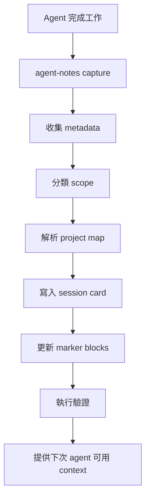

# Agent Notes PRD

## 1. 總覽

Agent Notes 是一個 local-first 筆記管理 CLI，用於 AI-assisted work。它會擷取 agent 完成的 session，轉成結構化 Markdown，安全更新專案、客戶、活動或團隊 context，並為下一次 session 準備精簡可用的 context packet。

第一批目標使用者是所有使用 AI agent 協作的人，包括一般上班族、行銷工作者、廣告投手、PM、業務、顧問、企業主管、老闆、技術管理者與開發者。他們希望用 Obsidian-compatible notes 建立穩定、可交接、可追溯的共享記憶系統。

## 2. 問題

AI agent 完成任務後，常產生有價值的工作資訊，但這些資訊通常分散在：

- 不同工具的 transcript
- 短期 chat context
- agent-specific memory store
- 臨時 Markdown 筆記
- 與實際進度逐漸脫節的 project docs、會議紀錄、活動筆記或客戶紀錄

結果是每次重新開工都要重讀 context，決策遺失，任務清單過期，投放調整脈絡不清，客戶或團隊交接不穩。

## 3. 目標

- 提供可重複執行的 CLI workflow，讓 agent 穩定寫入 session note。
- 用最少人工維護成本保持專案、客戶、活動與團隊 context 更新。
- 讓未來 agent 能快速找到相關前情。
- 同時支援專案任務與一般問答、閒聊、非專案討論。
- 不要求 Obsidian app 必須開啟。
- 避免私密資訊進入公開 repo。
- 讓同事與朋友能快速建立標準 Agent Notes vault。

## 4. 非目標

- 取代 Obsidian。
- 取代 agent 原生 memory 系統。
- 儲存 secret 或 credential。
- 第一版就做完整 hosted SaaS。
- 綁定特定 AI vendor。
- 完美解析所有 raw transcript。

## 5. 目標使用者

| 使用者 | 需求 |
| --- | --- |
| 一般上班族 | 把 AI 協助完成的文件、會議、任務、問答整理成可回顧的工作紀錄 |
| 行銷工作人員 | 保存 campaign 發想、文案修改、素材決策、成效檢討與後續行動 |
| 廣告投手 | 追蹤投放調整、預算變更、受眾測試、素材表現與優化假設 |
| PM / 專案管理者 | 維護需求、決策、進度、阻塞、跨部門交接 |
| 業務 / 顧問 | 整理客戶脈絡、提案紀錄、待辦事項與後續追蹤 |
| 企業主管 / 老闆 | 快速掌握團隊進度、重要決策、風險、待處理事項 |
| 技術主管 / 開發者 | 追蹤實作進度、技術決策、跨 repo 工作與踩坑經驗 |
| 團隊成員 | 快速採用一套現成 vault workflow |
| AI agent | 開工前取得精簡且有效的 context |

## 6. 核心使用情境

### 6.1 擷取專案工作

當 agent 在某個 repo 完成有意義的工作後：

```bash
agent-notes capture --repo "$PWD" --tool codex --scope project --summary-file ./agent-summary.md
```

預期結果：

- 在對應專案底下建立 session card
- 包含 summary、changes、validation、decisions、next steps、handoff notes
- v0.1 只從 summary-file 的明確 sections 做 deterministic marker 更新，不推論未提供的任務或決策

### 6.2 新增第一個專案

`init` 只會建立標準 Agent Notes vault 與 local config，不會自動猜測使用者的專案。首次使用者應能在 onboarding 末段或之後用 command 新增第一個專案：

```bash
agent-notes project add --repo "$PWD"
```

預期結果：

- 依目前資料夾推測 project name 與 repoId
- 將真實 repo path 寫入本機 project map
- 在 vault 中建立 `03-Projects/<project>/` 的標準 context 與 sessions 目錄
- 不把絕對 repo path 寫入 session card frontmatter

### 6.3 開工前取得 context

agent 開始處理任務前：

```bash
agent-notes context --repo "$PWD"
```

預期結果：

- 依 repo path 找到對應專案
- 輸出 bounded context packet
- 包含 project summary、active tasks、recent sessions、decisions、known pitfalls

### 6.4 處理非專案對話

不是所有有用筆記都屬於專案。Agent Notes 會把對話分類到以下 scope：

| Scope | 目的地 | 規則 |
| --- | --- | --- |
| ignore | 不寫入 | 低價值一次性閒聊 |
| daily | daily note | 輕量活動紀錄 |
| inbox | `01-Inbox/` | 可能有價值但尚未分類 |
| area | `04-Areas/` | 可重複使用的技術或商業知識 |
| personal | `00-Meta/Personal/` | 長期使用者偏好或工作風格 |
| project | `03-Projects/` | repo、專案、客戶、campaign 或團隊特定工作 |

### 6.5 定期彙整

此為 Phase 3 能力，不屬於 v0.1 MVP。

```bash
agent-notes rollup --daily
agent-notes rollup --weekly
```

預期結果：

- 依專案彙整 sessions
- 列出 decisions、completed work、blocked work、next steps
- 將可長期保存的 lessons 推進 area notes 或 project context

### 6.6 系統健康檢查

```bash
agent-notes doctor
```

預期結果：

- 驗證 vault path
- 驗證 project map
- 檢查必要目錄是否可寫
- 偵測 Obsidian CLI 是否可用
- 檢查 Git 狀態
- 警告可能被追蹤的私密檔案
- 檢查 hooks 是否已設定

### 6.7 新使用者安裝後 onboarding

首次使用者透過 `npx` 或 `npm install -g` 安裝後，Agent Notes 不應自動修改 Codex、Claude Code、OpenClaw 或其他 agent 的 hook 設定。安裝後的預設體驗應是引導式設定。

不安裝全域 binary 時：

```bash
npx agent-notes@latest init
npx agent-notes@latest doctor
```

全域安裝時：

```bash
npm install -g agent-notes
agent-notes init
agent-notes doctor
```

預期結果：

- `init` 第一題先選擇介面語言
- `init` 建立 local config 與 vault 目錄結構
- `init` 可詢問是否將目前資料夾加入第一個 project
- `doctor` 檢查本機設定、vault、project map 與可選整合
- `init` 可在 onboarding 末段讓使用者多選要設定的 agent integrations
- `integrate --list` 顯示目前支援的 agent integration
- `integrate <agent> --dry-run` 顯示會修改哪些本機設定與呼叫哪些 command
- 只有使用者在 `init` wizard 或 `integrate <agent> --apply` 中明確確認時，才允許寫入 hook 設定
- 未全域安裝時，後續 command 都應使用 `npx agent-notes@latest ...`
- hook integration 建議使用全域安裝或固定 binary path，避免 hook 執行時找不到 CLI

`init` 的語言選擇規則：

- 產品預設語言為英文
- 第一題提供 `English` 與 `繁體中文`
- 使用者可用 `agent-notes init --lang en` 或 `agent-notes init --lang zh-TW` 跳過互動
- 偵測到系統 locale 為 `zh_TW` 或 `zh-TW` 時，將 `繁體中文` 排在第一個選項或設為預選
- 選定語言後，後續提示、錯誤訊息與預設模板跟著該語言產生
- 語言設定寫入 local config，例如 `locale: "zh-TW"`

`init` 的 vault 建立規則：

- `init` 一律建立新的標準 Agent Notes vault，不把既有 Obsidian vault 當作初始化目標
- 預設路徑為 `~/Documents/Agent-Notes/`
- 使用者可輸入自訂路徑，但該路徑仍代表新的標準 Agent Notes vault
- 建立前必須顯示完整路徑與將建立的標準目錄，並取得確認
- 若目標目錄已存在且非空，不能覆蓋、清空或在其中補結構；必須請使用者選擇新的路徑，或建議遞增路徑如 `~/Documents/Agent-Notes-2/`
- 標準 vault 建立後，使用者可用 Obsidian 開啟該 vault，並在 Obsidian 內與其他 vault 切換
- 既有 Obsidian vault 的整理、轉換或匯入不屬於 `init` 職責，應做成後續獨立 Import Assistant workflow

## 7. 資訊架構

建議 vault 結構：

```text
.gitignore
00-Meta/
  Systems/
    agent-note-protocol.md
    project-map.example.json
01-Inbox/
  shared-capture/
02-Daily/
03-Projects/
  <project>/
    03-context/
      README.md
      active-tasks.md
      decision-log.md
      pitfalls.md
    04-sessions/
04-Areas/
05-Resources/
06-Templates/
07-Archives/
private/
  raw-sessions/
```

新 vault 的 `.gitignore` 必須至少排除 `private/` 與 `.agent-notes/`。`private/raw-sessions/` 只在使用者明確啟用 `--include-raw` 時使用，且應被 vault `.gitignore`、`doctor` 與文件明確標示為不應公開同步的私密資料。

## 8. 資料模型

### 8.1 Local Config

Local config 放在使用者本機，不應 commit 到 public repo：

```json
{
  "version": 1,
  "locale": "zh-TW",
  "vaultPath": "$HOME/Documents/Agent-Notes",
  "projectMapPath": "$HOME/.config/agent-notes/project-map.json",
  "privacy": {
    "defaultVisibility": "private",
    "recordAbsolutePathsInNotes": false,
    "copyRawTranscripts": false
  },
  "integrations": {
    "codex": {
      "enabled": false
    }
  }
}
```

規則：

- `locale` 預設 `en`，但系統 locale 為 `zh_TW` 或 `zh-TW` 時可預選 `zh-TW`
- `vaultPath` 指向標準 Agent Notes vault
- `projectMapPath` 指向本機或 private project map
- `recordAbsolutePathsInNotes` 預設 `false`
- `copyRawTranscripts` 預設 `false`
- integration 狀態只記錄本機設定，不寫入 secret

### 8.2 Session Card Frontmatter

```yaml
---
type: agent-session
schemaVersion: 1
title: "Short session title"
date: 2026-06-06
agent: codex
tool: Codex
projectId: example
project: Example
repoId: example
scope: project
status: done
visibility: private
source:
  kind: summary-file
  ref: local-summary-2026-06-06
  rawIncluded: false
tags:
  - session
  - codex
---
```

規則：

- `visibility` 預設為 `private`
- `public-safe` 必須由使用者明確指定，並通過 `doctor` 的敏感資訊掃描
- session card frontmatter 預設不寫入絕對 repo path、vault path、user home path 或 private project map path
- 真實 repo path 只放在 local config 或 private project map
- `scope: project` 時，`projectId` 與 `repoId` 必填，且必須可回查到 local project map
- `scope: inbox | daily | area | personal` 時，`projectId`、`repoId` 與 `project` display field 可省略
- 非 project scope 的目的地由 `scope` 決定，例如 `inbox` 寫入 `01-Inbox/`，`daily` 寫入 `02-Daily/`

### 8.3 Session Card Body

```markdown
# Short session title

## Summary

## Changes

## Decisions

## Validation

## Next Steps

## Handoff

## Source
```

### 8.4 Project Map

Project map 預設應放本機或私有位置。

```json
{
  "version": 1,
  "vaultPath": "$HOME/Documents/Agent-Notes",
  "projects": [
    {
      "id": "example",
      "name": "Example",
      "repoId": "example",
      "repoPaths": ["$HOME/repos/example"],
      "notePath": "03-Projects/Example",
      "tags": ["example"],
      "visibility": "private"
    }
  ]
}
```

規則：

- project map 是 local/private 資料，不應 commit 到 public repo
- public repo 只能放 `project-map.example.json` 這類不含真實路徑的範例
- `repoPaths` 可以包含絕對路徑，但只存在本機或 private companion repo
- `notePath` 是相對於 Agent Notes vault 的路徑
- v0.1 預設單一 Agent Notes vault，多 vault support 放到 post-MVP

### 8.5 Capture Contract

v0.1 的 capture protocol 採 deterministic input，不嘗試完美解析所有 transcript：

```bash
agent-notes capture --repo "$PWD" --tool codex --scope project --summary-file ./agent-summary.md
```

規則：

- `--scope` 可選，值為 `ignore | daily | inbox | area | personal | project`
- 未提供 `--scope` 時，CLI 依 `--repo` 是否能解析 project map 做 deterministic routing
- `--scope project` 時，`--repo` 必填且必須解析到 project；失敗時回傳 `PROJECT_NOT_FOUND`
- `--scope` 為非 project 時，`--repo` 只作為本機 routing metadata，不寫入 session card frontmatter
- `--scope ignore` 不建立 session card，只輸出 routing result
- 除 `--scope ignore` 外，`--summary-file` 為必填，內容必須是 UTF-8 Markdown
- `--summary-file` 必須包含固定 headings：`Summary`、`Changes`、`Decisions`、`Validation`、`Next Steps`、`Handoff`
- headings 必須使用 level 2 Markdown heading，例如 `## Summary`
- headings 名稱與順序必須嚴格比對；大小寫不符時回傳 `INVALID_SUMMARY_FILE`
- `Summary` 必須有內容；其他 section 可空白，但 heading 必須存在
- 缺少必要 heading 或 `Summary` 空白時，回傳 `INVALID_SUMMARY_FILE`
- CLI 可在產生 session card 時保留空 section，但不得自行推測未提供的事實
- `--source-file` 可選，只建立本機 pointer，不預設複製原始 transcript
- `--include-raw` 為 opt-in，且必須搭配 `--source-file`
- 啟用 `--include-raw` 時，raw copy 目的地固定為被忽略的 `private/raw-sessions/`
- frontmatter 只存 opaque source ref，不存 `--source-file` 的絕對路徑
- opaque source ref 對應表存放在 vault 內被忽略的 `.agent-notes/source-index.json`
- raw copy 應有 size limit、redaction warning 與覆寫防護
- 啟用 `--include-raw` 時輸出必須標 `visibility: private`
- raw transcript 不得在 MVP 預設寫入 vault
- 未提供 `--scope` 且 `--repo` 找不到 project 時，預設寫入 inbox，並提示使用 `agent-notes project add --repo "$PWD"`

## 9. Marker Block 策略

Agent Notes 只能更新明確標記的 generated regions：

```markdown
<!-- agent-notes:start active-tasks -->
Generated content.
<!-- agent-notes:end active-tasks -->
```

規則：

- 不重寫 marker block 外的人工內容
- 保留未知內容
- marker block 格式異常時安全失敗
- v0.1 只允許從 summary-file 的明確 sections 更新 generated blocks，例如從 `Next Steps` 更新 active tasks，從 `Decisions` 更新 decision log
- 不從自由文字推論新任務、決策或風險
- dry-run 只輸出 unified diff，不寫檔
- 所有實際 marker write 都必須先建立 backup
- backup 放在被 vault `.gitignore` 排除的 `.agent-notes/backups/`
- backup 保留策略預設至少保留最近 20 份或最近 7 天
- 寫入前取得 single-writer lock，避免多個 agent hook 同時更新同一檔案
- 寫入使用 temporary file + atomic rename
- 寫入前後檢查檔案 mtime 或 content hash，偵測到競態變更時停止
- 目標檔案有未解決 conflict marker 時停止
- backup 建立失敗時不得寫入目標檔案，並回傳 `BACKUP_FAILED`
- 其他失敗時回傳可機器判讀的 exit code，例如 `MARKER_MISSING`、`MARKER_INVALID`、`WRITE_CONFLICT`

## 10. 分類策略

Agent Notes 寫入前應先分類內容：

```yaml
type: chat | qa | idea | learning | decision | task | incident | session
scope: ignore | daily | inbox | area | personal | project
promote: false
confidence: 0.0
```

預設行為：

- 純閒聊：ignore 或 daily one-liner
- 一般問答：daily；若可重複使用則進 area
- 有用但不確定分類：inbox
- 可複用技術經驗：area
- repo、專案、客戶或 campaign-specific task：project
- 長期使用者偏好：personal 或 system note

v0.1 分類規則必須 deterministic：

- 不使用 hosted LLM 或 local LLM 自動分類
- 使用者明確提供 `--scope` 時以該值為準
- `--repo` 能解析到 project map 時，預設為 `project`
- `--repo` 無法解析時，預設寫入 `inbox`
- `confidence` 只記錄 deterministic routing 的信心，不代表模型判斷
- LLM-assisted classification 放到 post-MVP，且必須先處理隱私與 redaction

## 11. Runtime 架構



## 12. 整合

### 12.1 Core Runtime

必要能力：

- filesystem access
- Markdown writer
- YAML frontmatter parser
- project map resolver
- Git status checker

### 12.2 Optional Obsidian CLI

可選能力：

- 搜尋筆記
- 開啟產生的 note
- 檢查 backlinks
- 驗證 properties
- 讀取 active note

核心 CLI 必須能在 Obsidian 未開啟時運作。

### 12.3 Agent Hooks

預計整合：

- Codex Stop hook
- OpenClaw cron 或 session summary workflow
- Claude Code hook
- 手動 shell command

所有 hooks 都應呼叫同一個 CLI，不應讓每個 agent 自己產生 Markdown 格式。

Agent Notes 不應在 `npm install`、`npx agent-notes` 或 `agent-notes init` 的預設流程中自動新增 hook。Hook 設定屬於高信任本機設定，會影響 agent 每次結束 session 的行為，因此必須採用明確授權流程。`init` 可以提供 optional integration wizard，但該 wizard 必須呼叫同一套 `integrate` engine，且沒有使用者最後確認不得寫入。

| 模式 | Command | 行為 |
| --- | --- | --- |
| Manual | `agent-notes capture ...` | 使用者或 agent 手動呼叫 CLI，不修改 agent 設定 |
| Guided | `agent-notes integrate <agent> --dry-run` | 偵測環境並預覽將寫入的 hook 設定 |
| Apply | `agent-notes integrate <agent> --apply` | 使用者明確同意後才寫入本機 hook 設定 |
| Init wizard | `agent-notes init` | 可多選 agents，逐一 dry-run，最後確認後委派 `integrate` engine 寫入 |

`init` 的 integration wizard 必須支援多選。使用者可以一次選擇 Codex、Claude Code、OpenClaw 等多個 agent，也可以選擇暫不設定。多選後仍需逐一顯示 dry-run 摘要，並在使用者確認後才套用。

`integrate` engine 必須遵守以下規則：

- 預設 read-only
- `integrate --list` 只把目前可安全套用的 agent 標為 supported；尚未支援者可顯示為 coming soon 或 unavailable
- 修改前顯示目標檔案、變更摘要與可回復方式
- 不寫入 secret、token、channel id 或私有 project map
- 不假設所有使用者的 agent config path、shell、權限或 agent 版本一致
- 寫入前建立 backup 或提供可手動套用的 patch
- 失敗時不得影響既有 agent 設定

## 13. 隱私與 Repo 策略

公開 repo 放：

- README
- public-safe PRD
- public templates
- sample project map
- generic hook examples
- generic docs

私有 repo 或本機私有分支放：

- internal PRD
- 真實 project map
- 公司特定 channel mappings
- 敏感 runbook
- 客戶名稱或私有商業情境

重要規則：檔案一旦 commit 並 push 到公開 GitHub repo，就視為公開。Git 不支援在同一個 public repo 內做 per-file privacy。

建議配置：

```text
agent-notes/                 public repo
agent-notes-private/         private repo
~/.config/agent-notes/       local config and secrets
```

## 14. CLI Command Plan

| Command | 階段 | 用途 |
| --- | --- | --- |
| `init` | v0.1 | 建立標準 Agent Notes vault、初始化 config，並可選擇啟動 integration wizard |
| `project` | v0.1 | 新增、列出與檢查 project map entries |
| `capture` | v0.1 | 從目前 context 或指定檔案建立 session card |
| `context` | v0.1 | 為 repo 輸出 context packet |
| `doctor` | v0.1 | 驗證設定 |
| `integrate` | v0.1 | 偵測、預覽與明確套用 agent hook integration |
| `rollup` | Phase 3 | 產生每日或每週摘要 |
| `classify` | post-MVP | 預覽 routing decision |
| `sync` | post-MVP | 可選 Git-aware note sync helper |

### 14.1 安裝後預設流程

`init` 是使用者第一次執行時的主要入口。MVP 的 `init` 應聚焦在建立 local-first runtime，而不是直接接管 agent：

1. 選擇語言，並依系統 locale 調整預選順序
2. 選擇標準 Agent Notes vault 的建立路徑，預設使用 `~/Documents/Agent-Notes/`
3. 若目標路徑已存在且非空，提示改用新的路徑，不在既有 Obsidian vault 補結構
4. 顯示將建立的標準 vault 目錄與檔案
5. 使用者確認後才建立必要目錄
6. 建立新的 Obsidian-compatible Agent Notes vault
7. 建立 `~/.config/agent-notes/config.json`
8. 建立本機 project map
9. 詢問是否把目前資料夾加入第一個 project
10. 顯示 manual capture 與 context command 範例
11. 詢問是否現在連接 AI agents，並提供可多選的 agent 清單
12. 對使用者選取的每個 agent 顯示 dry-run 摘要與確認提示
13. 使用者逐一確認後，委派 `integrate` engine 套用對應設定
14. 自動執行或建議執行 `agent-notes doctor`

Hook integration engine 必須獨立於 `init`，讓使用者日後可用 `agent-notes integrate ...` 補設定；`init` 只是首次 onboarding 的互動式呼叫入口。

## 15. MVP 範圍

Version 0.1 應包含：

- Node.js + TypeScript CLI
- `init`
- `doctor`
- `project add --repo`
- `context --repo`
- `capture --repo --tool --scope --summary-file`
- `integrate --list`
- `integrate <agent> --dry-run`
- `integrate <agent> --apply`
- 至少一個 supported agent integration，優先支援 Codex
- direct Markdown writes
- project map support
- frontmatter schema
- marker block updater
- dry-run mode
- 安裝後下一步提示
- routing 與 marker replacement 的基礎測試

## 16. Roadmap

### Phase 1：Local CLI

- 建立 Node.js + TypeScript CLI
- 定義 schema
- 寫入並驗證 Markdown
- 支援 project context retrieval
- 支援安裝後 onboarding、project add 與 integration dry-run/apply
- 優先完成 Codex integration；Claude Code 與 OpenClaw 可先顯示為 coming soon

### Phase 2：Agent Hooks

- OpenClaw workflow integration
- Claude Code hook integration
- dry-run safeguards
- 更完整的 agent config path 偵測與回復工具

### Phase 3：Rollups

- daily summaries
- weekly summaries
- decision extraction
- task extraction
- area knowledge promotion

### Phase 4：Sharing Kit

- installer script
- template vault files
- sample config
- `agent-notes doctor --fix`
- public documentation site 或 GitHub Pages

### Phase 5：Vault Import Assistant

- 掃描既有 Obsidian vault
- 產生整理、轉換或匯入計畫
- 只複製需要匯入的內容到標準 Agent Notes vault
- 不移動、不刪除、不修改舊 vault
- 預設 dry-run，apply 前必須逐步確認

## 17. 成功指標

- 新 agent 能在 30 秒內找到相關 project context。
- Session notes 都以有效 frontmatter 穩定寫入。
- Project active tasks 與 decisions 不需人工複製也能保持更新。
- 非專案閒聊不污染 project notes。
- 私密資料不被 tracked 到公開 repo。
- 團隊成員能在 10 分鐘內安裝並跑起 MVP。

## 18. 風險

| 風險 | 緩解方式 |
| --- | --- |
| 過度擷取低價值閒聊 | classification 預設 ignore/daily |
| 私密資料外洩 | 預設 private、真實路徑只放 local config、doctor warnings、public-safe examples |
| raw transcript 外洩 | MVP 不預設複製 raw，`--include-raw` 必須 opt-in 並標 private |
| agent 產生的 Markdown 格式漂移 | 由單一 CLI 負責格式 |
| Obsidian dependency 不穩 | filesystem-first design |
| 人工筆記被覆蓋 | marker blocks 與 dry-run mode |
| 並發寫入造成筆記損壞 | single-writer lock、atomic write、content hash 檢查 |
| 自動 hook 修改造成使用者不信任 | 不在 install 或 init 預設流程自動修改 hook，採 dry-run 與最後確認 |

## 19. Open Questions

- Phase 3 rollup 要用 deterministic extraction、local LLM，還是 hosted LLM？
- 第一批正式支援的 agent hook 順序應是 Codex、Claude Code 還是 OpenClaw？
- Import Assistant 的互動 UX 要採逐檔確認、批次確認，還是只輸出可套用計畫？
- private companion repo 是否需要官方 scaffold，或只先提供文件建議？

## 20. 初始建議

第一版先做小型 filesystem-first CLI，包含標準 vault 初始化、project map、capture、context、marker block updater 與明確授權的 agent hook integration。Optional Obsidian CLI、rollup 與 Import Assistant 放到後續階段。公開 repo 保持不含私密 mapping 與內部策略；真正內部 PRD 或公司特定設定應放在 private companion repo 或本機設定中。
