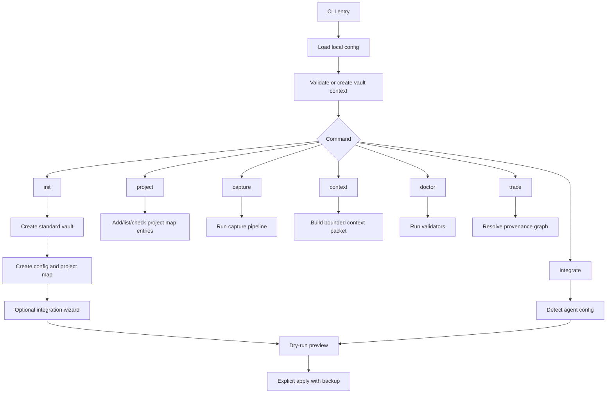
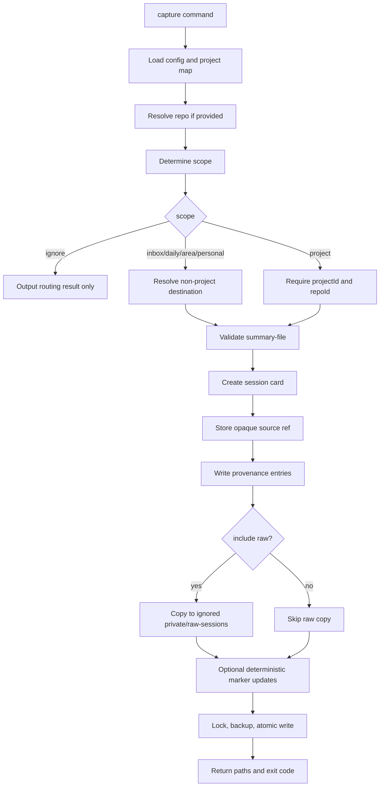
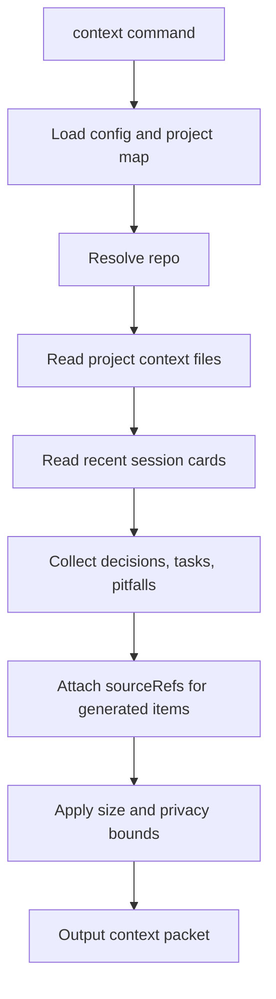

# Agent Notes PRD

## 1. 總覽

Agent Notes 是一個 local-first 筆記管理 CLI，用於 AI-assisted work。它會擷取 agent 完成的 session，轉成結構化 Markdown，安全更新專案、客戶、活動或團隊 context，並為下一次 session 準備精簡可用的 context packet。

第一批目標使用者是所有使用 AI agent 協作的人，包括一般上班族、行銷工作者、廣告投手、PM、業務、顧問、企業主管、老闆、技術管理者與開發者。他們希望用 Obsidian-compatible notes 建立穩定、可交接、可追溯的共享記憶系統。

## 2. 問題

AI agent 完成任務後，常產生有價值的工作資訊，但這些資訊通常分散在：

- 不同工具的 transcript
- 短期 chat context
- agent-specific memory store
- 臨時 Markdown 筆記
- 與實際進度逐漸脫節的 project docs、會議紀錄、活動筆記或客戶紀錄

結果是每次重新開工都要重讀 context，決策遺失，任務清單過期，投放調整脈絡不清，客戶或團隊交接不穩。

## 3. 目標

- 提供可重複執行的 CLI workflow，讓 agent 穩定寫入 session note。
- 用最少人工維護成本保持專案、客戶、活動與團隊 context 更新。
- 讓未來 agent 能快速找到相關前情。
- 同時支援專案任務與一般問答、閒聊、非專案討論。
- 不要求 Obsidian app 必須開啟。
- 避免私密資訊進入公開 repo。
- 讓同事與朋友能快速建立標準 Agent Notes vault。

## 4. 非目標

- 取代 Obsidian。
- 取代 agent 原生 memory 系統。
- 儲存 secret 或 credential。
- 第一版就做完整 hosted SaaS。
- 綁定特定 AI vendor。
- 完美解析所有 raw transcript。

## 5. 目標使用者

| 使用者 | 需求 |
| --- | --- |
| 一般上班族 | 把 AI 協助完成的文件、會議、任務、問答整理成可回顧的工作紀錄 |
| 行銷工作人員 | 保存 campaign 發想、文案修改、素材決策、成效檢討與後續行動 |
| 廣告投手 | 追蹤投放調整、預算變更、受眾測試、素材表現與優化假設 |
| PM / 專案管理者 | 維護需求、決策、進度、阻塞、跨部門交接 |
| 業務 / 顧問 | 整理客戶脈絡、提案紀錄、待辦事項與後續追蹤 |
| 企業主管 / 老闆 | 快速掌握團隊進度、重要決策、風險、待處理事項 |
| 技術主管 / 開發者 | 追蹤實作進度、技術決策、跨 repo 工作與踩坑經驗 |
| 團隊成員 | 快速採用一套現成 vault workflow |
| AI agent | 開工前取得精簡且有效的 context |

## 6. 核心使用情境

### 6.1 擷取專案工作

當 agent 在某個 repo 完成有意義的工作後：

```bash
agent-notes capture --repo "$PWD" --tool codex --scope project --summary-file ./agent-summary.md
```

預期結果：

- 在對應專案底下建立 session card
- 包含 summary、changes、validation、decisions、next steps、handoff notes
- v0.1 只從 summary-file 的明確 sections 做 deterministic marker 更新，不推論未提供的任務或決策

### 6.2 新增第一個專案

`init` 只會建立標準 Agent Notes vault 與 local config，不會自動猜測使用者的專案。首次使用者應能在 onboarding 末段或之後用 command 新增第一個專案：

```bash
agent-notes project add --repo "$PWD"
```

預期結果：

- 依目前資料夾推測 project name 與 repoId
- 將真實 repo path 寫入本機 project map
- 在 vault 中建立 `03-Projects/<project>/` 的標準 context 與 sessions 目錄
- 不把絕對 repo path 寫入 session card frontmatter

### 6.3 開工前取得 context

agent 開始處理任務前：

```bash
agent-notes context --repo "$PWD"
```

預期結果：

- 依 repo path 找到對應專案
- 輸出 bounded context packet
- 包含 project summary、active tasks、recent sessions、decisions、known pitfalls

### 6.4 處理非專案對話

不是所有有用筆記都屬於專案。Agent Notes 會把對話分類到以下 scope：

| Scope | 目的地 | 規則 |
| --- | --- | --- |
| ignore | 不寫入 | 低價值一次性閒聊 |
| daily | daily note | 輕量活動紀錄 |
| inbox | `01-Inbox/` | 可能有價值但尚未分類 |
| area | `04-Areas/` | 可重複使用的技術或商業知識 |
| personal | `00-Meta/Personal/` | 長期使用者偏好或工作風格 |
| project | `03-Projects/` | repo、專案、客戶、campaign 或團隊特定工作 |

### 6.5 定期彙整

此為 Phase 3 能力，不屬於 v0.1 MVP。

```bash
agent-notes rollup --daily
agent-notes rollup --weekly
```

預期結果：

- 依專案彙整 sessions
- 列出 decisions、completed work、blocked work、next steps
- 將可長期保存的 lessons 推進 area notes 或 project context

### 6.6 系統健康檢查

```bash
agent-notes doctor
```

預期結果：

- 驗證 vault path
- 驗證 project map
- 檢查必要目錄是否可寫
- 偵測 Obsidian CLI 是否可用
- 檢查 Git 狀態
- 警告可能被追蹤的私密檔案
- 檢查 hooks 是否已設定

### 6.7 新使用者安裝後 onboarding

首次使用者透過 `npx` 或 `npm install -g` 安裝後，Agent Notes 不應自動修改 Codex、Claude Code、OpenClaw 或其他 agent 的 hook 設定。安裝後的預設體驗應是引導式設定。

不安裝全域 binary 時：

```bash
npx agent-notes@latest init
npx agent-notes@latest doctor
```

全域安裝時：

```bash
npm install -g agent-notes
agent-notes init
agent-notes doctor
```

預期結果：

- `init` 第一題先選擇介面語言
- `init` 建立 local config 與 vault 目錄結構
- `init` 可詢問是否將目前資料夾加入第一個 project
- `doctor` 檢查本機設定、vault、project map 與可選整合
- `init` 可在 onboarding 末段讓使用者多選要設定的 agent integrations
- `integrate --list` 顯示目前支援的 agent integration
- `integrate <agent> --dry-run` 顯示會修改哪些本機設定與呼叫哪些 command
- 只有使用者在 `init` wizard 或 `integrate <agent> --apply` 中明確確認時，才允許寫入 hook 設定
- 未全域安裝時，後續 command 都應使用 `npx agent-notes@latest ...`
- hook integration 建議使用全域安裝或固定 binary path，避免 hook 執行時找不到 CLI

`init` 的語言選擇規則：

- 產品預設語言為英文
- 第一題提供 `English` 與 `繁體中文`
- 使用者可用 `agent-notes init --lang en` 或 `agent-notes init --lang zh-TW` 跳過互動
- 偵測到系統 locale 為 `zh_TW`、`zh-TW`、`zh_TW.UTF-8`、`zh-Hant-TW` 或等價 locale 時，將 `繁體中文` 排在第一個選項或設為預選
- locale 偵測順序建議為 `LC_ALL`、`LC_MESSAGES`、`LANG`、作業系統 API fallback
- 選定語言後，後續提示、錯誤訊息與模板說明文字跟著該語言產生
- machine-readable template headings 永遠維持英文，例如 `## Summary`，避免不同語言 template 破壞 capture parser
- 語言設定寫入 local config，例如 `locale: "zh-TW"`

`init` 的 vault 建立規則：

- `init` 一律建立新的標準 Agent Notes vault，不把既有 Obsidian vault 當作初始化目標
- macOS 預設路徑為 `~/Documents/Agent-Notes/`
- Linux desktop 預設路徑為 `$XDG_DOCUMENTS_DIR/Agent-Notes/`，找不到時使用 `~/Documents/Agent-Notes/`
- Windows 預設路徑為 `%USERPROFILE%\\Documents\\Agent-Notes\\`
- server/headless 環境若找不到 Documents 目錄，應要求使用者提供 `--vault-path`，不得猜測寫入目前工作目錄
- 使用者可輸入自訂路徑，但該路徑仍代表新的標準 Agent Notes vault
- 建立前必須顯示完整路徑與將建立的標準目錄，並取得確認
- 若目標目錄已存在且是 valid Agent Notes vault，但 local config 尚未指向它，`init` v0.1 不得直接採用或綁定；必須請使用者選擇新的路徑，並提示未來可用 Import Assistant 或 reconfigure workflow 處理
- 若目標目錄已存在且非空但不是 valid Agent Notes vault，不能覆蓋、清空或在其中補結構；必須請使用者選擇新的路徑，或建議遞增路徑如 `~/Documents/Agent-Notes-2/`
- 標準 vault 建立後，使用者可用 Obsidian 開啟該 vault，並在 Obsidian 內與其他 vault 切換
- 既有 Obsidian vault 的整理、轉換或匯入不屬於 `init` 職責，應做成後續獨立 Import Assistant workflow

`init` state machine：

| State | 偵測條件 | 行為 |
| --- | --- | --- |
| `fresh` | 找不到 config，目標 vault path 不存在或為空目錄 | 進入完整 onboarding |
| `already-initialized` | config 有效，vault path 是 valid Agent Notes vault | 不重建；顯示狀態，建議 `doctor` |
| `partial-init` | config 或 vault 只建立一部分，且 local config dir 有對應的 `init-state.json` | 提供 resume / rollback / choose new path |
| `invalid-config` | config 存在但 schema 無效 | 回傳 `CONFIG_INVALID`，不得覆蓋；提示備份後修復或重新 init |
| `existing-valid-vault` | 目標 path 是 valid Agent Notes vault，但 config 尚未指向它 | 回傳 `VAULT_ALREADY_INITIALIZED`；MVP 不採用、不綁定，建議選擇新路徑 |
| `existing-non-agent-dir` | 目標 path 非空且不是 Agent Notes vault | 回傳 `VAULT_EXISTS_NON_EMPTY`，建議新路徑 |
| `unsafe-target` | 目標 path 在一般 Git worktree、repo root、系統目錄或不可寫位置 | 強警告；非互動模式回傳 `PATH_UNSAFE` 或 `PATH_INVALID` |

規則：

- valid Agent Notes vault 至少需要 vault `.gitignore`、`00-Meta/Systems/agent-note-protocol.md`、`06-Templates/` 與必要 context template
- `init` 必須可重跑且 idempotent；不得因重跑而覆蓋現有筆記、config、project map 或 hook 設定
- 初始化期間應把 `init-state.json` 寫在 local config dir，例如 `~/.config/agent-notes/init-state.json`，並以 canonical target vault path 作 key；完成後移除或標記 `complete`
- vault 內 `.agent-notes/` 只可在 vault `.gitignore` 已建立且驗證會忽略 `.agent-notes/` 後寫入
- 任一步驟失敗時不得留下已 tracked 的 partial private data
- rollback 只能移除本次 init 建立且尚未被使用者修改的檔案；無法安全 rollback 時必須提示人工處理

`init` non-interactive contract：

```bash
agent-notes init --yes --lang zh-TW --vault-path "$HOME/Documents/Agent-Notes" --no-integrations --no-project
```

規則：

- 非 TTY 環境不得顯示互動 prompt；缺少必要參數時回傳 `NON_INTERACTIVE_REQUIRED`
- `--yes` 只代表接受本次 command 顯示的 safe defaults，不得略過 destructive 或 high-trust 操作
- `--lang` 與 `--vault-path` 可跳過語言與路徑 prompt
- `--no-integrations` 跳過 integration wizard
- `--no-project` 跳過「是否加入目前資料夾為第一個 project」
- `--project-repo <path>` 可明確指定要加入的第一個 project；不得在非 git / unsafe cwd 自動推測
- `--allow-git-worktree-vault` 明確允許把 vault 建在一般 Git worktree 內；此 flag 只解除 `PATH_UNSAFE`，不解除 private data 掃描
- `--resume` 明確要求從 local config dir 的 `init-state.json` 恢復未完成的初始化
- `--rollback` 明確要求回復本次未完成初始化能安全移除的檔案
- `--dry-run` 只顯示將建立的目錄、config、project map 與 integration plan，不寫檔
- `--force` 不屬於 MVP；MVP 不提供覆蓋既有目錄的強制模式

`init` safety checks：

- Node.js runtime 版本不符合 package `engines` 時回傳 `RUNTIME_UNSUPPORTED`
- config 目錄需依平台解析：macOS/Linux 使用 XDG 或 `~/.config/agent-notes/`，Windows 使用 `%APPDATA%\\agent-notes\\`
- vault path 必須 canonicalize，並處理 `~`、環境變數、symlink 與相對路徑
- 目標 path 是檔案、parent 不存在且無法建立、parent 不可寫、或 path 含非法字元時回傳 `PATH_INVALID`
- 目標 path 位於一般 Git worktree 內時，必須警告 private vault 可能被 track；非互動模式預設拒絕，除非提供 `--allow-git-worktree-vault`
- 目標 path 位於 iCloud Drive、OneDrive、Dropbox 等同步資料夾時，應提示可能出現同步衝突，但可由使用者確認後繼續
- 第一個 project onboarding 只在 cwd 是可讀 git repo 或使用者明確提供 `--project-repo` 時詢問
- cwd 是 home、Documents、vault path、系統目錄、非 git 目錄或不可讀目錄時，不詢問加入 project
- integration wizard 若偵測到 CLI 是 `npx` ephemeral path，不應直接 apply hook；應要求 global install、固定 binary path 或顯示 manual patch
- integration 多選 apply 採 per-agent transaction：單一 agent 失敗不得影響其他 agent，最後輸出 success / skipped / failed 摘要
- integration apply 前必須 backup；partial failure 時保留 backup path 與 manual recovery instructions
- 使用者取消任何 prompt 時回傳 `INIT_CANCELLED`，不得視為成功

## 7. 資訊架構

建議 vault 結構：

```text
.gitignore
00-Meta/
  Systems/
    agent-note-protocol.md
    project-map.example.json
    source-manifest.md              # Phase 4 optional
    provenance-manifest.md          # Phase 4 optional
    team-project-catalog.example.json # Phase 4 optional
01-Inbox/
  shared-capture/
02-Daily/
03-Projects/
  <project>/
    03-context/
      README.md
      active-tasks.md
      decision-log.md
      pitfalls.md
    04-sessions/
04-Areas/
05-Resources/
06-Templates/
07-Archives/
private/
  raw-sessions/
```

新 vault 的 `.gitignore` 必須至少排除 `private/` 與 `.agent-notes/`。`private/raw-sessions/` 只在使用者明確啟用 `--include-raw` 時使用，且應被 vault `.gitignore`、`doctor` 與文件明確標示為不應公開同步的私密資料。

## 8. 資料模型

### 8.1 Local Config

Local config 放在使用者本機，不應 commit 到 public repo：

```json
{
  "version": 1,
  "locale": "zh-TW",
  "vaultPath": "$HOME/Documents/Agent-Notes",
  "projectMapPath": "$HOME/.config/agent-notes/project-map.json",
  "privacy": {
    "defaultVisibility": "private",
    "recordAbsolutePathsInNotes": false,
    "copyRawTranscripts": false
  },
  "sharing": {
    "mode": "personal",
    "access": "read-write",
    "agentWritePolicy": "local-only"
  },
  "integrations": {
    "codex": {
      "enabled": false
    }
  }
}
```

規則：

- `locale` 預設 `en`，但系統 locale 為 `zh_TW` 或 `zh-TW` 時可預選 `zh-TW`
- `vaultPath` 指向標準 Agent Notes vault
- `projectMapPath` 指向本機或 private project map
- `recordAbsolutePathsInNotes` 預設 `false`
- `copyRawTranscripts` 預設 `false`
- `sharing.mode` v0.1 預設 `personal`，post-MVP 可選值規劃為 `personal | team`
- `sharing.access` 可選值規劃為 `read-write | read-only`
- `sharing.agentWritePolicy` 可選值規劃為 `none | local-only | branch-pr | direct`
- v0.1 schema 只接受 `personal` + `read-write` + `local-only`；若 config 出現尚未實作的 team sharing 值，CLI 必須回傳 `FEATURE_UNSUPPORTED`，不得靜默接受
- `published-read-only` 不是 vault config mode，而是 `publish --readonly` 產生的衍生 artifact
- integration 狀態只記錄本機設定，不寫入 secret

### 8.2 Session Card Frontmatter

```yaml
---
type: agent-session
schemaVersion: 1
title: "Short session title"
date: 2026-06-06
agent: codex
tool: Codex
projectId: example
project: Example
repoId: example
scope: project
status: done
visibility: private
source:
  kind: summary-file
  ref: local-summary-2026-06-06
  rawIncluded: false
sourceRefs:
  - src_20260606_codex_001
derivedItems:
  decisions:
    - DEC-0001
  tasks:
    - TASK-0001
tags:
  - session
  - codex
---
```

規則：

- `visibility` 可選值為 `private | team-safe | public-safe`
- `visibility` 預設為 `private`
- `team-safe` 表示可放入 private Team Vault，但不可公開發布
- `public-safe` 表示可公開發布
- `team-safe` 與 `public-safe` 必須由使用者明確指定，並通過 `doctor` 的敏感資訊掃描；agent 不得自動把 `private` note 升級為可共享狀態
- session card frontmatter 預設不寫入絕對 repo path、vault path、user home path 或 private project map path
- 真實 repo path 只放在 local config 或 private project map
- `scope: project` 時，`projectId` 與 `repoId` 必填，且必須可回查到 local project map
- `scope: inbox | daily | area | personal` 時，`projectId`、`repoId` 與 `project` display field 可省略
- 非 project scope 的目的地由 `scope` 決定，例如 `inbox` 寫入 `01-Inbox/`，`daily` 寫入 `02-Daily/`
- `sourceRefs` 必須使用 opaque source id，不得使用本機絕對路徑
- `derivedItems` 記錄本 session 產出的 decision、task、context update 等 item id

### 8.3 Session Card Body

```markdown
# Short session title

## Summary

## Changes

## Decisions

## Validation

## Next Steps

## Handoff

## Source
```

### 8.4 Project Map

Project map 預設應放本機或私有位置。

```json
{
  "version": 1,
  "vaultPath": "$HOME/Documents/Agent-Notes",
  "projects": [
    {
      "id": "example",
      "name": "Example",
      "repoId": "example",
      "repoPaths": ["$HOME/repos/example"],
      "notePath": "03-Projects/Example",
      "tags": ["example"],
      "visibility": "private"
    }
  ]
}
```

規則：

- project map 是 local/private 資料，不應 commit 到 public repo
- public repo 只能放 `project-map.example.json` 這類不含真實路徑的範例
- `repoPaths` 可以包含絕對路徑，但只存在本機或 private companion repo
- `notePath` 是相對於 Agent Notes vault 的路徑
- v0.1 預設單一 Agent Notes vault，多 vault support 放到 post-MVP

#### Team Project Catalog

Team Vault 不能依賴每位使用者的絕對 `repoPaths`。post-MVP 應拆成 tracked team catalog 與 per-user ignored binding：

```json
{
  "version": 1,
  "projects": [
    {
      "projectId": "example",
      "repoId": "example",
      "name": "Example",
      "notePath": "03-Projects/Example",
      "aliases": ["example-app"],
      "visibility": "team-safe"
    }
  ]
}
```

規則：

- Team project catalog 只保存 `projectId`、`repoId`、`name`、`notePath`、`aliases` 與 team-approved metadata
- Team project catalog 不得保存個人本機絕對路徑
- 每位使用者自己的 repo path binding 存在被忽略的 `.agent-notes/repo-bindings.json` 或 local config
- Team Vault 使用者應使用 `agent-notes project attach --repo "$PWD" --project-id <id>` 建立本機 binding
- `context --repo` 在 Team Vault 中先查本機 binding；找不到時回傳 `PROJECT_NOT_FOUND`，並提示使用 `project attach`
- `project add --repo` 在 personal vault 建立 local project map；Team Vault 的 tracked catalog 新增流程屬於 post-MVP，必須受 write policy 控制

#### Team Target Binding

每個 personal project 可對應一個或多個 Team Vault target。這份 mapping 屬於 local/private config，不應寫入 public repo，也不應寫入 shared Markdown。

```json
{
  "version": 1,
  "targets": [
    {
      "projectId": "example",
      "teamVaultId": "team-example",
      "teamVaultPath": "$HOME/Documents/Agent-Notes-Team",
      "teamNotePath": "03-Projects/Example",
      "promotionMode": "manual-pr",
      "writePolicy": "branch-pr"
    }
  ]
}
```

規則：

- `teamVaultPath` 是使用者本機 checkout 路徑，只能存在 local/private config
- `teamNotePath` 是相對於 Team Vault 的路徑，必須對應 Team project catalog 的 `notePath`
- `promotionMode` 可規劃為 `off | manual-pr | auto-pr-candidate`
- `off` 不產生 Team Vault candidate
- `manual-pr` 只在使用者或 agent 明確呼叫 `promote` 時產生 branch/PR handoff
- `auto-pr-candidate` 允許 hook 在通過 gating 後自動建立 candidate branch，但仍不得直接寫入 Team Vault main
- v0.1 不需要實作 Team target binding；若 config 出現 team target，應回傳 `FEATURE_UNSUPPORTED`

### 8.5 Capture Contract

v0.1 的 capture protocol 採 deterministic input，不嘗試完美解析所有 transcript：

```bash
agent-notes capture --repo "$PWD" --tool codex --scope project --summary-file ./agent-summary.md
```

規則：

- `--scope` 可選，值為 `ignore | daily | inbox | area | personal | project`
- `--visibility` 可選，值為 `private | team-safe | public-safe`，預設 `private`
- `team-safe` 或 `public-safe` 只能由使用者明確指定，或由使用者預先允許的 project policy 指定；classification 不得自行升級 visibility
- 未提供 `--scope` 時，CLI 依 `--repo` 是否能解析 project map 做 deterministic routing
- `--scope project` 時，`--repo` 必填且必須解析到 project；失敗時回傳 `PROJECT_NOT_FOUND`
- `--scope` 為非 project 時，`--repo` 只作為本機 routing metadata，不寫入 session card frontmatter
- `--scope ignore` 不建立 session card，只輸出 routing result
- 除 `--scope ignore` 外，`--summary-file` 為必填，內容必須是 UTF-8 Markdown
- `--summary-file` 必須包含固定 headings：`Summary`、`Changes`、`Decisions`、`Validation`、`Next Steps`、`Handoff`
- headings 必須使用 level 2 Markdown heading，例如 `## Summary`
- headings 名稱與順序必須嚴格比對；大小寫不符時回傳 `INVALID_SUMMARY_FILE`
- `Summary` 必須有內容；其他 section 可空白，但 heading 必須存在
- 缺少必要 heading 或 `Summary` 空白時，回傳 `INVALID_SUMMARY_FILE`
- CLI 可在產生 session card 時保留空 section，但不得自行推測未提供的事實
- `--source-file` 可選，只建立本機 pointer，不預設複製原始 transcript
- `--include-raw` 為 opt-in，且必須搭配 `--source-file`
- 啟用 `--include-raw` 時，raw copy 目的地固定為被忽略的 `private/raw-sessions/`
- frontmatter 只存 opaque source ref，不存 `--source-file` 的絕對路徑
- opaque source ref 對應表存放在 vault 內被忽略的 `.agent-notes/source-index.json`
- raw copy 應有 size limit、redaction warning 與覆寫防護
- 啟用 `--include-raw` 時輸出必須標 `visibility: private`
- raw transcript 不得在 MVP 預設寫入 vault
- 若 `--visibility team-safe | public-safe` 但 sensitive scan 失敗，`capture` 必須回傳 `PRIVATE_DATA_RISK`
- 未提供 `--scope` 且 `--repo` 找不到 project 時，v0.1 personal vault 預設寫入 inbox，並提示使用 `agent-notes project add --repo "$PWD"`；Phase 4 Team Vault 則提示使用 `agent-notes project attach --repo "$PWD" --project-id <id>`

### 8.6 Provenance Model

所有由 Agent Notes 產生或更新的決策、任務、context 摘要與 pitfalls，都必須能回溯來源。公開可讀 Markdown 只放 opaque ids；真實 source path、raw source hash 與 local metadata 只放在被 vault `.gitignore` 排除的 `.agent-notes/`。Team Vault 若需要共享來源資訊，必須使用 tracked team-safe source manifest，不得把本機 source index 變成共享資料。

#### Source Index

`.agent-notes/source-index.json` 儲存 source ref 與本機來源的對應：

```json
{
  "version": 1,
  "sources": {
    "src_20260606_codex_001": {
      "kind": "summary-file",
      "tool": "codex",
      "capturedAt": "2026-06-06T12:00:00+08:00",
      "localPath": "$HOME/tmp/agent-summary.md",
      "contentHash": "sha256:...",
      "privacy": "private",
      "rawIncluded": false,
      "redacted": false
    }
  }
}
```

規則：

- `sourceRef` 格式建議為 `src_<YYYYMMDD>_<tool>_<sequence>`
- `localPath` 只能存在 `.agent-notes/source-index.json`
- session card、decision log、active tasks、context files 只能引用 opaque `sourceRef`
- `contentHash` 用於驗證本機 source 是否被修改；若 hash 對象是 raw transcript 或本機檔案，hash 只能存在 `.agent-notes/source-index.json`
- personal mode 找不到 source ref 時，`trace` 回傳 `SOURCE_NOT_FOUND`
- 若團隊需要共同追溯同一個來源，應使用可共享的 `sourceKind`、`tool`、`capturedAt`、`ownerAlias`、PR/MR URL 或文件 URL 等 metadata，不得要求他人讀取另一位使用者的本機路徑

#### Team-safe Source Manifest

Team Vault 可 tracked 一份 team-safe source manifest，例如 `00-Meta/Systems/source-manifest.md`，用來保存能被團隊共享的來源摘要。這份 manifest 不是 local source index，不能存本機絕對路徑、raw transcript hash 或私人檔案路徑。

範例：

```markdown
<!-- agent-notes:start source-manifest -->
- sourceRef: src_20260606_codex_001
  sourceKind: pull-request
  tool: codex
  capturedAt: 2026-06-06T12:00:00+08:00
  ownerAlias: bw
  safeSourceUrl: https://example.com/org/repo/pull/123
  safeContentHash: sha256:...
<!-- agent-notes:end source-manifest -->
```

規則：

- `safeSourceUrl` 只能指向團隊有權讀取的 PR/MR、issue、文件或其他 approved source
- `safeContentHash` 只能針對 public-safe 或 team-safe artifact 計算，不得代表 raw transcript 或本機私人檔案
- Team Vault 的 `trace` 找不到本機 source index 但找到 source manifest 時，應顯示 degraded trace 與 team-safe metadata，exit code 仍為 `OK`
- 只有 source index 與 source manifest 都找不到目標 source ref 時，才回傳 `SOURCE_NOT_FOUND`

#### Team-safe Provenance Manifest

Team Vault 不能依賴 ignored `.agent-notes/provenance.jsonl` 作為唯一 trace 來源。Phase 4 可 tracked 一份 team-safe provenance manifest，例如 `00-Meta/Systems/provenance-manifest.md`，用來保存 item-level provenance 的公開給團隊版本。

範例：

```markdown
<!-- agent-notes:start provenance-manifest -->
- itemId: DEC-0001
  itemType: decision
  sessionId: SES-20260606-001
  sourceRefs:
    - src_20260606_codex_001
  derivedFrom: summary-file:Decisions
  notePath: 03-Projects/Example/03-context/decision-log.md
<!-- agent-notes:end provenance-manifest -->
```

規則：

- Team provenance manifest 不得保存本機絕對路徑、raw transcript path 或私人檔案 hash
- Team Vault generated blocks 與 session cards 必須保留 `session`、`sourceRefs` 與 `derivedFrom`，讓 `trace` 可從 tracked Markdown fallback
- Team Vault `trace` 查找順序應為 local `.agent-notes/provenance.jsonl`、tracked team provenance manifest、tracked session cards / marker blocks、team source manifest
- 若 item 有 `sourceRefs` 但找不到 session、derivedFrom 或 tracked provenance，`trace` / `doctor` 應回傳 `PROVENANCE_ORPHAN`，不得只因找到 source manifest 就回 `OK`

#### Provenance Log

`.agent-notes/provenance.jsonl` 記錄 item 產生、更新與來源關係：

```json
{"event":"derived","itemId":"DEC-0001","itemType":"decision","sessionId":"SES-20260606-001","sourceRefs":["src_20260606_codex_001"],"derivedFrom":"summary-file:Decisions","createdAt":"2026-06-06T12:05:00+08:00"}
```

規則：

- 每個 generated item 必須有 `itemId`
- decision id 使用 `DEC-0001`
- task id 使用 `TASK-0001`
- context update id 使用 `CTX-0001`
- pitfall id 使用 `PIT-0001`
- marker updater 更新既有 item 時必須保留 item id
- 無法確認來源的 generated item 不得寫入 project context，只能留在 inbox 或 dry-run output

#### Generated Item Format

Decision log generated block：

```markdown
<!-- agent-notes:start decision-log -->
- DEC-0001 | 採用 Node.js + TypeScript 作為 MVP CLI runtime
  - status: accepted
  - sourceRefs: src_20260606_codex_001
  - session: SES-20260606-001
<!-- agent-notes:end decision-log -->
```

Active tasks generated block：

```markdown
<!-- agent-notes:start active-tasks -->
- TASK-0001 | 實作 marker block updater
  - status: planned
  - sourceRefs: src_20260606_codex_001
  - relatedDecisions: DEC-0001
<!-- agent-notes:end active-tasks -->
```

#### Trace Command

```bash
agent-notes trace DEC-0001
agent-notes trace TASK-0001
agent-notes trace src_20260606_codex_001
```

預期輸出：

- item id 與 type
- item 所在 note path
- sourceRefs
- session id
- derivedFrom section
- content hash
- 若 source 位於本機 private index，顯示 safe local summary，不直接把絕對路徑寫入 Markdown

## 9. Marker Block 策略

Agent Notes 只能更新明確標記的 generated regions：

```markdown
<!-- agent-notes:start active-tasks -->
Generated content.
<!-- agent-notes:end active-tasks -->
```

規則：

- 不重寫 marker block 外的人工內容
- 保留未知內容
- marker block 格式異常時安全失敗
- v0.1 只允許從 summary-file 的明確 sections 更新 generated blocks，例如從 `Next Steps` 更新 active tasks，從 `Decisions` 更新 decision log
- 不從自由文字推論新任務、決策或風險
- 每個 generated item 必須有穩定 item id 與 `sourceRefs`
- 更新既有 generated item 時必須保留 item id，不可因重新生成而換 id
- 無 sourceRefs 的 generated item 不得寫入 marker block
- dry-run 只輸出 unified diff，不寫檔
- 所有實際 marker write 都必須先建立 backup
- backup 放在被 vault `.gitignore` 排除的 `.agent-notes/backups/`
- backup 保留策略預設至少保留最近 20 份或最近 7 天
- 寫入前取得 single-writer lock，避免多個 agent hook 同時更新同一檔案
- 寫入使用 temporary file + atomic rename
- 寫入前後檢查檔案 mtime 或 content hash，偵測到競態變更時停止
- 目標檔案有未解決 conflict marker 時停止
- backup 建立失敗時不得寫入目標檔案，並回傳 `BACKUP_FAILED`
- 其他失敗時回傳可機器判讀的 exit code，例如 `MARKER_MISSING`、`MARKER_INVALID`、`WRITE_CONFLICT`

## 10. 分類策略

Agent Notes 寫入前應先分類內容：

```yaml
type: chat | qa | idea | learning | decision | task | incident | session
scope: ignore | daily | inbox | area | personal | project
promote: false
confidence: 0.0
```

預設行為：

- 純閒聊：ignore 或 daily one-liner
- 一般問答：daily；若可重複使用則進 area
- 有用但不確定分類：inbox
- 可複用技術經驗：area
- repo、專案、客戶或 campaign-specific task：project
- 長期使用者偏好：personal 或 system note
- `promote` v0.1 預設一律為 `false`
- post-MVP 只有在 session 為 `team-safe`、存在 team target binding、具備 sourceRefs 且通過 privacy scan 時，才可把 `promote` 視為 promotion candidate；它不代表自動 merge 到 Team Vault main

v0.1 分類規則必須 deterministic：

- 不使用 hosted LLM 或 local LLM 自動分類
- 使用者明確提供 `--scope` 時以該值為準
- `--repo` 能解析到 project map 時，預設為 `project`
- `--repo` 無法解析時，預設寫入 `inbox`
- `confidence` 只記錄 deterministic routing 的信心，不代表模型判斷
- LLM-assisted classification 放到 post-MVP，且必須先處理隱私與 redaction

## 11. Runtime 架構

Runtime 必須是 filesystem-first，所有 command 共用同一組核心元件，不讓不同 agent 或不同 command 自己產生 Markdown 格式。

### 11.1 核心元件

| 元件 | 責任 |
| --- | --- |
| Config Loader | 讀取 `~/.config/agent-notes/config.json`，套用 locale、vault path、privacy defaults |
| Vault Manager | 建立與驗證標準 Agent Notes vault、vault `.gitignore`、必要目錄與模板 |
| Project Resolver | 讀取 local/private project map，依 repo path 解析 `projectId`、`repoId`、`notePath` |
| Router | 依 `--scope`、repo resolution 與 deterministic rules 決定目的地 |
| Capture Parser | 驗證 `--summary-file` headings 與必要內容，處理 `--source-file` pointer |
| Frontmatter Writer | 產生 session card frontmatter，不寫入絕對路徑或 private project map path |
| Source Index | 維護 `.agent-notes/source-index.json`，將 opaque source ref 對應到本機 source path |
| Provenance Store | 維護 `.agent-notes/provenance.jsonl`，記錄 source、session、derived item 的關係 |
| Marker Updater | 只更新 marker block 內 generated content，支援 dry-run、backup、lock、atomic write |
| Context Builder | 讀取 project context、recent sessions、decisions、pitfalls，輸出 bounded context packet |
| Trace Resolver | 依 item id 或 source ref 追溯 session、source、note path 與 derivedFrom |
| Doctor | 驗證 config、vault、project map、Git 狀態、private path 與 integration 狀態 |
| Integration Engine | 偵測、dry-run、backup、apply agent hook 設定 |

### 11.2 Command Runtime



規則：

- `init` 是唯一可建立新 vault 的 command
- `project` 只修改 local/private project map 與對應 vault 目錄
- `capture` 負責建立 session card 與 deterministic marker updates
- `context` 不寫入 vault，只輸出 bounded context packet
- `doctor` 預設 read-only；未來 `doctor --fix` 需另行明確授權
- `integrate` engine 可由 `init` wizard 呼叫，也可由使用者獨立執行
- `trace` 預設 read-only，只讀取 session cards、source index 與 provenance log

### 11.3 Capture Pipeline



規則：

- `--scope ignore` 不讀寫 session card
- `--scope project` 必須成功解析 project map
- 未提供 `--scope` 時，repo resolution 成功才走 project，失敗則走 inbox
- `summary-file` 驗證必須早於任何寫入
- source path 只寫入 `.agent-notes/source-index.json`，session card 只存 opaque ref
- `--include-raw` 才能複製 raw，且目的地固定在被忽略的 `private/raw-sessions/`
- marker updates 只能使用 summary-file 的明確 sections，不做 LLM 推論
- decisions、tasks、context updates 寫入 marker 前必須先產生 provenance entry
- 寫入 session card、source index、raw copy、marker block 前都必須遵守 lock / backup / atomic write 規則

### 11.4 Context Pipeline



規則：

- `context` 不應呼叫 LLM
- `context` 不應讀取 `private/raw-sessions/`
- 輸出必須有 size bound，避免塞滿下一個 agent 的 context
- context packet 中的 generated decisions/tasks 應保留 item id 與 sourceRefs
- 找不到 project 時回傳 `PROJECT_NOT_FOUND`；v0.1 personal vault 提示 `agent-notes project add --repo "$PWD"`；Phase 4 Team Vault 提示 `agent-notes project attach --repo "$PWD" --project-id <id>`

## 12. 整合

### 12.1 Core Runtime

必要能力：

- filesystem access
- Markdown writer
- YAML frontmatter parser
- project map resolver
- Git status checker

### 12.2 Optional Obsidian CLI

可選能力：

- 搜尋筆記
- 開啟產生的 note
- 檢查 backlinks
- 驗證 properties
- 讀取 active note

核心 CLI 必須能在 Obsidian 未開啟時運作。

### 12.3 Agent Hooks

預計整合：

- Codex Stop hook
- OpenClaw cron 或 session summary workflow
- Claude Code hook
- 手動 shell command

所有 hooks 都應呼叫同一個 CLI，不應讓每個 agent 自己產生 Markdown 格式。

Agent Notes 不應在 `npm install`、`npx agent-notes` 或 `agent-notes init` 的預設流程中自動新增 hook。Hook 設定屬於高信任本機設定，會影響 agent 每次結束 session 的行為，因此必須採用明確授權流程。`init` 可以提供 optional integration wizard，但該 wizard 必須呼叫同一套 `integrate` engine，且沒有使用者最後確認不得寫入。

| 模式 | Command | 行為 |
| --- | --- | --- |
| Manual | `agent-notes capture ...` | 使用者或 agent 手動呼叫 CLI，不修改 agent 設定 |
| Guided | `agent-notes integrate <agent> --dry-run` | 偵測環境並預覽將寫入的 hook 設定 |
| Apply | `agent-notes integrate <agent> --apply` | 使用者明確同意後才寫入本機 hook 設定 |
| Init wizard | `agent-notes init` | 可多選 agents，逐一 dry-run，最後確認後委派 `integrate` engine 寫入 |

`init` 的 integration wizard 必須支援多選。使用者可以一次選擇 Codex、Claude Code、OpenClaw 等多個 agent，也可以選擇暫不設定。多選後仍需逐一顯示 dry-run 摘要，並在使用者確認後才套用。

`integrate` engine 必須遵守以下規則：

- 預設 read-only
- `integrate --list` 只把目前可安全套用的 agent 標為 supported；尚未支援者可顯示為 coming soon 或 unavailable
- 修改前顯示目標檔案、變更摘要與可回復方式
- 不寫入 secret、token、channel id 或私有 project map
- 不假設所有使用者的 agent config path、shell、權限或 agent 版本一致
- 寫入前建立 backup 或提供可手動套用的 patch
- 失敗時不得影響既有 agent 設定

## 13. 隱私與 Repo 策略

公開 repo 放：

- README
- public-safe PRD
- public templates
- sample project map
- generic hook examples
- generic docs

私有 repo 或本機私有分支放：

- internal PRD
- 真實 project map
- 公司特定 channel mappings
- 敏感 runbook
- 客戶名稱或私有商業情境

重要規則：檔案一旦 commit 並 push 到公開 GitHub repo，就視為公開。Git 不支援在同一個 public repo 內做 per-file privacy。

建議配置：

```text
agent-notes/                 public repo
agent-notes-private/         private repo
~/.config/agent-notes/       local config and secrets
```

### 13.1 Team Sharing Model

Agent Notes 的共享策略應維持 local-first，但允許團隊用 Git 或唯讀匯出共享一份標準 vault。共享不應把使用者的個人 vault、公司產品 repo 與公開 Agent Notes repo 混在一起。

建議分層：

| 層級 | 用途 | 儲存位置 | 權限模型 |
| --- | --- | --- | --- |
| Personal Vault | 個人 agent 工作紀錄與私人筆記 | 每位使用者本機，例如 `~/Documents/Agent-Notes/` | 使用者與本機 agent 可讀寫 |
| Team Vault | 團隊共用的 project context、session cards、decisions、tasks、pitfalls | 獨立 private Git repo，內容本身仍是標準 Agent Notes vault | 依 repo 權限控管 read-only 或 read-write |
| Published Read-only | 給主管、老闆或跨部門檢視的摘要 | sanitized Markdown、靜態網站或文件匯出 | 唯讀，不提供 agent 寫入 |

規則：

- `init` v0.1 一律建立新的 Personal Vault，不直接初始化 Team Vault
- Team Vault 應是獨立 private Git repo，不應放在 public `agent-notes` repo，也不應直接塞進產品程式碼 repo
- Team Vault 仍必須符合標準 Agent Notes vault 結構；CLI 不應為團隊模式發明另一套筆記格式
- Obsidian 可以開啟多個 vault，因此 Personal Vault 與 Team Vault 應並存，不應強迫使用者把既有個人 vault 改造成團隊 vault
- `private/`、`.agent-notes/`、raw transcript、本機絕對路徑與個人 project map 不應進入 Team Vault 的 Git tracked content
- 若 Team Vault 需要設定 repo 對應，應使用 team-safe aliases、repo ids 或 private companion repo，不應在 shared Markdown 寫入個人本機路徑

### 13.2 Team Access Modes

以下是 Phase 4 design。v0.1 若讀到 `sharing.mode=team`，必須在 command dispatch 前回傳 `FEATURE_UNSUPPORTED`，不得只實作部分 Team Vault 行為。Team sharing 至少需要支援三種 vault access 組合，並把 read-only publishing 視為 export artifact，避免「共享」同時代表共同編輯、唯讀檢視與公開發布而造成混淆：

| Effective mode | Config 組合 | 說明 | 允許命令 |
| --- | --- | --- | --- |
| Personal | `mode=personal`、`access=read-write`、`agentWritePolicy=local-only` | 個人本機 vault，v0.1 預設模式 | `init`、`project`、`capture`、`context`、`doctor`、`integrate`、`trace`，post-MVP 可支援 `promote` |
| Team read-only | `mode=team`、`access=read-only`、`agentWritePolicy=none` | 使用者或 agent 只能讀取 Team Vault context | `context`、`trace`、`doctor --check`、`project list/check/attach`、`integrate --list/--dry-run` |
| Team read-write | `mode=team`、`access=read-write`、`agentWritePolicy=branch-pr` | 團隊成員與 agent 可對 Team Vault 提交變更 | `project`、`context`、`doctor`、`trace`、`promote --apply`，但必須受 write policy 控制 |

Team Vault command gating 規則：

- Team read-only 下，`capture`、`project add`、marker block write、raw copy、`promote --apply` 與任何會修改 Team Vault tracked content 的操作都必須拒絕
- Team read-write 下，會修改 Team Vault tracked content 的操作只能透過 `branch-pr` promotion flow 或明確受 write policy 控制的 project catalog 變更；不得 direct 寫 main
- `project list` 與 `project check` 可讀取 team catalog
- `project attach` 可寫入被忽略的 `.agent-notes/repo-bindings.json` 或 local config，但不得修改 Team Vault tracked catalog
- `doctor --check` 可檢查 shared vault 是否符合結構與 public-safe 規則，但不能自動修復 tracked content
- `integrate --list` 與 `integrate --dry-run` 可讀取本機 agent 設定；`integrate --apply` 是否允許應由本機設定權限決定，但不得寫入 shared vault
- `promote --dry-run` 可輸出 candidate 預覽；`promote --apply` 對 read-only Team Vault 必須回傳 `VAULT_READ_ONLY`
- hook 預設永遠只對 Personal Vault 執行 `capture`；Team Vault 不接受 hook direct capture
- 若未來支援 Team Vault `capture`，它只能作為 `promote` pipeline 的明確 alias，必須套用同一組 `team-safe`、sourceRefs、privacy scan 與 branch/PR gating
- CLI 必須用穩定錯誤碼回報唯讀寫入，例如 `VAULT_READ_ONLY`

寫入策略：

| Policy | 說明 | 建議用途 |
| --- | --- | --- |
| `none` | 禁止 agent 寫入 | 唯讀或主管檢視 |
| `local-only` | 只寫個人 vault | v0.1 預設 |
| `branch-pr` | 對 Team Vault 建立 local branch 與可 review handoff，不直接寫 main；自動建立 GitHub PR 或 GitLab MR 是後續 provider integration | 團隊共同編輯的建議模式 |
| `direct` | 允許直接寫入目前 branch | 只適用 personal 或 single-owner vault；Team promotion 不得使用 |

Team Vault 的 reviewed truth 應是 main branch。agent 在共同編輯時應優先使用 `branch-pr`，先產生 local branch、diff 與 commit handoff，再由人類或後續 provider integration 建立 PR/MR。若 worktree dirty、沒有 remote、provider 不支援或 branch policy 尚未實作，CLI 必須停止並回報明確錯誤。v0.1 不需要實作 distributed lock；若同一份 shared note 發生 Git conflict，CLI 應停止並提示使用者解衝突，而不是嘗試自動合併語意。

### 13.3 Team Promotion Workflow

Team promotion 指的是把 Personal Vault 中已整理過、可共享的 agent session 資訊，送到對應 Team Vault 的 review branch 或 PR/MR。它不是 raw transcript sync，也不是 agent 直接寫 Team Vault main。

預期流程：

1. agent 工作完成後，hook 呼叫 `agent-notes capture`，先更新 Personal Vault
2. CLI 依 deterministic classification、`visibility`、sourceRefs、team target binding 與 privacy scan 判斷是否可產生 team promotion candidate
3. 若專案沒有 team target、session 不是 `team-safe`、包含 raw transcript、doctor privacy scan 失敗或缺少 sourceRefs，promotion 必須停止
4. `manual-pr` 模式只輸出提示或 dry-run，等待使用者或 agent 明確呼叫 `agent-notes promote`
5. `auto-pr-candidate` 模式可在 hook 後自動建立 Team Vault local branch 與 diff/commit handoff，但不得直接 merge 或直寫 main
6. 有 provider integration 時，可在使用者授權後建立 GitHub PR 或 GitLab MR
7. Team Vault owner 或 maintainer 在 Git provider 中查看同事 agent 送出的 PR/MR，檢查內容是否可共享、是否有 private data、是否污染團隊 context
8. owner 合併後，Team Vault main 才成為團隊 reviewed truth

建議 command：

```bash
agent-notes promote --session SES-20260606-001 --target team-example --dry-run
agent-notes promote --session SES-20260606-001 --target team-example --apply
```

promotion candidate 必須包含：

- 來源 Personal Vault session id
- 來源 `sourceRefs`
- target `teamVaultId`
- target `teamNotePath`
- 本次會新增或更新的 session card、source manifest、decision log、active tasks 或 pitfalls
- privacy / doctor scan 結果
- 建議 PR/MR title、body、labels 與 reviewer/owner hint

PR/MR 規則：

- branch name 建議格式為 `agent-notes/<ownerAlias>/<sessionId>`
- PR/MR title 必須包含 project name、agent/tool 與 session date
- PR/MR body 必須列出 session id、sourceRefs、derived items、風險掃描結果與人工 review checklist
- PR/MR 不應包含 raw transcript、本機絕對路徑、`.agent-notes/`、`private/` 或 personal project map
- 若 provider integration 尚未支援，CLI 只產生 local branch、commit 與 handoff instructions
- Team promotion 一律不得使用 `direct` 寫入 Team Vault main；`direct` 只保留給 personal 或 single-owner vault 的非 promotion 操作

### 13.4 Shared Provenance

共享筆記仍必須可追溯，但不能把個人機器上的私密 mapping 分享出去。

規則：

- Team Vault tracked Markdown 可以保存 `sessionId`、`itemId`、opaque `sourceRefs`、team-safe metadata 與 optional `safeContentHash`
- 每位使用者的 `.agent-notes/source-index.json` 只負責本機 trace，不應 commit
- Team Vault 若需要跨人追溯，應保存可共享來源，例如 PR/MR URL、issue URL、文件 URL、commit hash、agent tool 名稱、capture time 與 `ownerAlias`
- promotion 產生的 Team Vault changes 必須保留來源 Personal Vault session id 與 sourceRefs，但不得要求 reviewer 讀取發起者本機 source index
- `trace` 在 Team Vault 找不到本機 source index 時，應退回顯示 tracked Markdown 與 team-safe metadata，不應報成資料損壞
- raw transcript 在 team sharing 中必須維持 opt-in，且預設不進入 Team Vault tracked content

### 13.5 Read-only Publishing

主管、老闆或跨部門成員不一定需要直接操作 Obsidian vault。post-MVP 可規劃 `publish --readonly --from <vault> --out <dir> --audience <team|public>`，輸出 sanitized Markdown、靜態網站或文件包。

`publish --readonly` 規則：

- 預設 audience 必須是 `public`，只輸出 `public-safe` content
- `--audience team` 可輸出 `team-safe` 與 `public-safe` content，但產物只適合 private team sharing，不可公開發布
- 排除 `private/`、`.agent-notes/`、raw transcript、本機絕對路徑與 private project map
- 保留決策、風險、待辦、session summary 與來源的 opaque ids
- 不提供 agent 寫入入口
- 產出必須包含 publish manifest，記錄來源 vault、產出時間、過濾規則與被排除的敏感資料類型
- 不取代 Team Vault，也不是 `sharing.mode`，只是 Team Vault 或 Personal Vault 的唯讀衍生物

## 14. CLI Command Plan

| Command | 階段 | 用途 |
| --- | --- | --- |
| `init` | v0.1 | 建立標準 Agent Notes vault、初始化 config，並可選擇啟動 integration wizard |
| `project` | v0.1 | 新增、列出與檢查 project map entries；Phase 4 支援 Team Vault `attach` |
| `capture` | v0.1 | 從目前 context 或指定檔案建立 session card，並可用 `--visibility` 明確設定 sharing visibility |
| `context` | v0.1 | 為 repo 輸出 context packet |
| `doctor` | v0.1 | 驗證設定 |
| `integrate` | v0.1 | 偵測、預覽與明確套用 agent hook integration |
| `trace` | v0.1 | 追溯 item id、session id 或 source ref 的來源 |
| `rollup` | Phase 3 | 產生每日或每週摘要 |
| `classify` | post-MVP | 預覽 routing decision |
| `sync` | post-MVP | 可選 Git-aware note sync helper |
| `promote` | Phase 4 | 將 `team-safe` personal session 產生 Team Vault branch/PR handoff |
| `publish` | Phase 4 | 產生 sanitized read-only sharing output |

### 14.1 安裝後預設流程

`init` 是使用者第一次執行時的主要入口。MVP 的 `init` 應聚焦在建立 local-first runtime，而不是直接接管 agent：

1. 選擇語言，並依系統 locale 調整預選順序
2. 選擇標準 Agent Notes vault 的建立路徑，預設使用 `~/Documents/Agent-Notes/`
3. 若目標路徑已存在且非空，提示改用新的路徑，不在既有 Obsidian vault 補結構
4. 顯示將建立的標準 vault 目錄與檔案
5. 使用者確認後才建立必要目錄
6. 建立新的 Obsidian-compatible Agent Notes vault
7. 建立 `~/.config/agent-notes/config.json`
8. 建立本機 project map
9. 詢問是否把目前資料夾加入第一個 project
10. 顯示 manual capture 與 context command 範例
11. 詢問是否現在連接 AI agents，並提供可多選的 agent 清單
12. 對使用者選取的每個 agent 顯示 dry-run 摘要與確認提示
13. 使用者逐一確認後，委派 `integrate` engine 套用對應設定
14. 自動執行或建議執行 `agent-notes doctor`

Hook integration engine 必須獨立於 `init`，讓使用者日後可用 `agent-notes integrate ...` 補設定；`init` 只是首次 onboarding 的互動式呼叫入口。

## 15. MVP 範圍

Version 0.1 應包含：

- Node.js + TypeScript CLI
- `init`
- `doctor`
- `project add --repo`
- `context --repo`
- `capture --repo --tool --scope --summary-file [--visibility]`
- `integrate --list`
- `integrate <agent> --dry-run`
- `integrate <agent> --apply`
- `trace <itemId|sessionId|sourceRef>`
- source index 與 provenance log
- 至少一個 supported agent integration，優先支援 Codex
- personal/local-only direct Markdown writes
- project map support
- frontmatter schema
- marker block updater
- dry-run mode
- init state machine、non-interactive flags 與安全檢查
- 安裝後下一步提示
- routing 與 marker replacement 的基礎測試

## 16. MVP Templates

MVP 必須內建 public-safe templates。`init` 建立新 vault 時，應產生標準模板檔；`capture` 與 `project add` 應使用同一組模板，不允許各 agent 自行拼 Markdown。

### 16.1 Vault `.gitignore`

```gitignore
private/
.agent-notes/
.DS_Store
```

### 16.2 Summary File Template

Agent 或使用者提供給 `capture --summary-file` 的檔案必須符合此格式：

```markdown
## Summary

## Changes

## Decisions

## Validation

## Next Steps

## Handoff
```

規則：

- headings 必須完整、順序固定、大小寫固定
- `Summary` 必須有內容
- headings 是 machine contract，所有 locale 的 template 都必須保留英文 heading
- localized template 只能翻譯註解、placeholder 或提示文字，不得翻譯 heading 名稱
- 其他 sections 可空白
- 不允許在 template 內放 secret、token、channel id、真實客戶敏感資訊或私有 repo mapping

### 16.3 Session Card Template

```markdown
---
type: agent-session
schemaVersion: 1
title: "{{title}}"
date: "{{date}}"
agent: "{{agent}}"
tool: "{{tool}}"
scope: "{{scope}}"
status: "{{status}}"
visibility: private
source:
  kind: "{{sourceKind}}"
  ref: "{{sourceRef}}"
  rawIncluded: false
sourceRefs:
  - "{{sourceRef}}"
derivedItems:
  decisions: []
  tasks: []
  contextUpdates: []
tags:
  - session
---

# {{title}}

## Summary

{{summary}}

## Changes

{{changes}}

## Decisions

{{decisions}}

## Validation

{{validation}}

## Next Steps

{{nextSteps}}

## Handoff

{{handoff}}

## Source

{{sourceSummary}}
```

`scope: project` 的 session card 需額外加入：

```yaml
projectId: "{{projectId}}"
project: "{{projectName}}"
repoId: "{{repoId}}"
```

### 16.4 Project Context Templates

`project add` 建立 project 目錄時，至少建立以下 context files：

```markdown
# {{projectName}}

Manual notes live outside generated blocks.

<!-- agent-notes:start project-summary -->
<!-- agent-notes:end project-summary -->
```

```markdown
# Active Tasks

Manual notes live outside generated blocks.

<!-- agent-notes:start active-tasks -->
- TASK-0001 | Example task title
  - status: planned
  - sourceRefs: src_example_001
<!-- agent-notes:end active-tasks -->
```

```markdown
# Decision Log

Manual notes live outside generated blocks.

<!-- agent-notes:start decision-log -->
- DEC-0001 | Example decision title
  - status: accepted
  - sourceRefs: src_example_001
<!-- agent-notes:end decision-log -->
```

```markdown
# Pitfalls

Manual notes live outside generated blocks.

<!-- agent-notes:start pitfalls -->
<!-- agent-notes:end pitfalls -->
```

規則：

- marker block 外的文字視為人工內容，不得自動覆蓋
- generated block 初始可為空；範例 item 只作為格式說明，實際 template 可不預填
- generated item 必須包含 item id 與 `sourceRefs`
- 檔名固定為 `README.md`、`active-tasks.md`、`decision-log.md`、`pitfalls.md`

## 17. Error Codes

MVP command 應使用穩定、可機器判讀的錯誤碼。CLI 可同時輸出人類可讀訊息，但測試應以 code 為準。

| Code | Exit | Command | 意義 | 建議動作 |
| --- | --- | --- | --- | --- |
| `OK` | 0 | all | 成功 | 無 |
| `CONFIG_NOT_FOUND` | 10 | all except `init` | 找不到 local config | 執行 `agent-notes init` |
| `CONFIG_INVALID` | 11 | all | local config schema 無效 | 修正 config 或重新 init |
| `VAULT_NOT_FOUND` | 12 | all except `init` | vault path 不存在 | 檢查 config 或重新 init |
| `VAULT_NOT_WRITABLE` | 13 | init/capture/project | vault 不可寫 | 修正權限或改路徑 |
| `VAULT_READ_ONLY` | 14 | capture/project/sync/promote | 目前 vault 或 sharing mode 不允許寫入 | 改用個人 vault、切換權限或建立 PR/MR |
| `VAULT_ALREADY_INITIALIZED` | 15 | init | 目標 path 已是 valid Agent Notes vault | 若 local config 已指向此 vault，執行 `doctor`；否則選擇新路徑，MVP 不直接採用 |
| `VAULT_EXISTS_NON_EMPTY` | 16 | init | 目標 path 非空且不是 Agent Notes vault | 選擇新路徑 |
| `INIT_PARTIAL` | 17 | init/doctor | 偵測到未完成的初始化狀態 | resume、rollback 或選擇新路徑 |
| `PATH_INVALID` | 18 | init | 目標 path 是檔案、不可建立、不可寫或非法 | 修正路徑 |
| `PATH_UNSAFE` | 19 | init | 目標 path 位於一般 Git worktree、系統目錄或其他高風險位置 | 改用安全路徑或明確允許 |
| `PROJECT_NOT_FOUND` | 20 | project/context/capture | repo 無法解析到 project | v0.1 personal vault 執行 `project add --repo "$PWD"`；Phase 4 Team Vault 執行 `project attach --repo "$PWD" --project-id <id>` |
| `PROJECT_MAP_INVALID` | 21 | project/context/capture/doctor | project map schema 無效 | 修正 project map |
| `INVALID_SCOPE` | 30 | capture | `--scope` 不在允許值 | 使用合法 scope |
| `INVALID_SUMMARY_FILE` | 31 | capture | summary file 缺 heading 或 Summary 空白 | 依 template 修正 summary file |
| `SOURCE_FILE_NOT_FOUND` | 32 | capture | `--source-file` 不存在 | 修正 source path 或移除參數 |
| `RAW_REQUIRES_SOURCE_FILE` | 33 | capture | `--include-raw` 未搭配 `--source-file` | 補 `--source-file` 或移除 `--include-raw` |
| `SOURCE_NOT_FOUND` | 34 | trace/doctor | 找不到 source ref | 檢查 source index 或重新 capture |
| `TRACE_TARGET_NOT_FOUND` | 35 | trace | 找不到 item id、session id 或 source ref | 確認 id 是否正確 |
| `PROVENANCE_ORPHAN` | 36 | doctor/trace | item 有 sourceRefs，但找不到 local provenance、team provenance manifest、team source manifest 或可 fallback 的 tracked Markdown | 執行 doctor 並修復 index 或 manifest |
| `MARKER_MISSING` | 40 | capture | 找不到必要 marker block | 重新建立 context template 或手動補 marker |
| `MARKER_INVALID` | 41 | capture | marker block 巢狀、缺 end 或 id 不一致 | 修正 marker block |
| `WRITE_CONFLICT` | 42 | capture/project | 寫入前檔案已被其他程序改動 | 重新執行 command |
| `BACKUP_FAILED` | 43 | capture/project/integrate | backup 建立失敗 | 檢查 `.agent-notes/backups/` 權限 |
| `PRIVATE_DATA_RISK` | 50 | doctor/capture | 偵測到可能外洩的絕對路徑或敏感 pattern | 改用 private config 或重新 redact |
| `INTEGRATION_UNSUPPORTED` | 60 | integrate/init | agent 尚未支援 apply | 查看 `integrate --list` |
| `INTEGRATION_NOT_FOUND` | 61 | integrate/init | 找不到目標 agent config | 安裝 agent 或指定 config path |
| `INTEGRATION_APPLY_FAILED` | 62 | integrate/init | hook 設定寫入失敗 | 檢查 backup 與權限 |
| `INTEGRATION_BINARY_UNSTABLE` | 63 | integrate/init | hook 會引用 ephemeral `npx` 或不穩定 binary path | 改用 global install、固定 binary path 或 manual patch |
| `INTEGRATION_PARTIAL_FAILED` | 64 | integrate/init | 多選 integration 部分成功、部分失敗 | 查看 per-agent summary 與 backup |
| `FEATURE_UNSUPPORTED` | 70 | all | config 或 command 使用尚未實作的 post-MVP 功能 | 改用 v0.1 支援模式或升級版本 |
| `RUNTIME_UNSUPPORTED` | 71 | all | Node.js 或作業系統版本不符合支援範圍 | 升級 runtime |
| `NON_INTERACTIVE_REQUIRED` | 72 | init | 非 TTY 環境缺少必要 flags | 補 `--yes`、`--lang`、`--vault-path` 等 flags |
| `INIT_CANCELLED` | 73 | init | 使用者取消初始化 | 不需處理，必要時重新執行 |
| `WORKTREE_DIRTY` | 80 | sync/capture/project/promote | branch handoff 前工作區已有未處理變更 | 先 commit、stash 或切換工作區 |
| `GIT_REMOTE_UNSUPPORTED` | 81 | sync/publish/promote | remote 或 provider 不支援目前操作 | 改用 local handoff 或手動建立 PR/MR |
| `BRANCH_POLICY_UNSUPPORTED` | 82 | sync/capture/project/promote | 目前版本尚未支援指定 branch write policy | 改用 `local-only` 或手動流程 |
| `TEAM_TARGET_NOT_FOUND` | 83 | promote | personal project 沒有可用 team target binding | 設定 team target 或改用 personal-only |
| `PROMOTION_NOT_ALLOWED` | 84 | promote | session 不符合 promotion gating，例如不是 `team-safe`、缺 sourceRefs、含 raw transcript 或 privacy scan 失敗 | 修正 session visibility、來源與敏感資訊後重試 |
| `PROMOTION_PROVIDER_UNSUPPORTED` | 85 | promote | 目前 provider 無法自動建立 PR/MR | 使用 local branch handoff 或手動建立 PR/MR |
| `UNKNOWN_ERROR` | 99 | all | 未分類錯誤 | 保留 log 並回報 |

## 18. Phase 1 Implementation Plan

第一階段開發應採可驗證的小切片，不一次實作所有 agent integration。

### 18.1 Scaffold

- 建立 Node.js + TypeScript 專案
- 設定 CLI entry、build、test、lint
- 建立 `src/commands/`、`src/core/`、`src/schemas/`、`src/templates/`
- 建立 fixture-based tests

### 18.2 Schemas and Config

- 定義 local config schema
- 定義 project map schema
- 定義 session frontmatter schema
- 定義 source index 與 provenance log schema
- 定義 error code enum
- 實作 config loader 與 path expansion

### 18.3 Vault Init

- 實作 `agent-notes init`
- 建立 `~/Documents/Agent-Notes/` 或使用者指定的新 path
- 建立 vault `.gitignore`
- 建立標準目錄與 templates
- 建立 local config 與 empty project map
- 實作 locale prompt 與 `--lang`
- 實作 locale normalization：`zh_TW`、`zh_TW.UTF-8`、`zh-Hant-TW` 等對應 `zh-TW`
- 實作 platform default paths：macOS、Linux、Windows、server/headless fallback
- 實作 init state machine：fresh、already-initialized、partial-init、invalid-config、existing-valid-vault、existing-non-agent-dir、unsafe-target；`existing-valid-vault` 在 MVP 只拒絕並建議新路徑
- 實作 local config dir `init-state.json`，以 canonical target vault path 作 key，支援 resume / rollback / complete
- 實作 idempotent init，重跑不得覆蓋 existing notes、config、project map 或 hook
- 實作 non-interactive flags：`--yes`、`--vault-path`、`--no-integrations`、`--no-project`、`--project-repo`、`--allow-git-worktree-vault`、`--resume`、`--rollback`、`--dry-run`
- 實作 path validation、canonical path、symlink handling、Git worktree detection 與 unsafe path warning
- 實作 runtime check，Node.js 不符合支援版本時回傳 `RUNTIME_UNSUPPORTED`
- 實作 first project safe cwd gating，只在明確安全 repo 詢問加入 project
- 確認所有 locale 的 templates 保留英文 machine headings

### 18.4 Project Map

- 實作 `agent-notes project add --repo`
- 產生 `projectId`、`repoId`、`notePath`
- 建立 project context templates
- 實作 `project list` 與 `project check`

### 18.5 Capture

- 實作 summary-file parser
- 實作 deterministic routing
- 實作 session card writer
- 實作 source index
- 實作 provenance log append
- 實作 optional raw copy
- 實作 inbox / daily / area / personal / project destinations

### 18.6 Marker Updater

- 實作 marker parser
- 實作 dry-run unified diff
- 實作 backup、single-writer lock、atomic write
- 保留既有 item id 並驗證 generated item 都有 `sourceRefs`
- 實作 marker error codes
- 加入 marker replacement tests

### 18.7 Context

- 實作 `agent-notes context --repo`
- 讀取 project README、active tasks、decision log、pitfalls、recent sessions
- context packet 保留 item id 與 sourceRefs
- 實作 size bound
- 確認不讀 `private/raw-sessions/`

### 18.8 Doctor

- 驗證 config、vault、project map、必要目錄、writable 狀態
- 檢查 private path 是否被 Git tracked
- 檢查 source index 與 raw storage
- 檢查 orphan sourceRefs、missing provenance records 與無來源 generated items
- 檢查 supported integrations

### 18.9 Trace

- 實作 `agent-notes trace <itemId|sessionId|sourceRef>`
- 讀取 source index、provenance log 與 session cards
- 輸出來源摘要、session id、note path、derivedFrom 與 content hash
- 不把本機絕對路徑寫入 Markdown

### 18.10 Integrate Codex

- 實作 `integrate --list`
- 優先支援 Codex dry-run
- 實作 Codex apply 前 backup 與最後確認
- 偵測 CLI binary path 是否穩定；ephemeral `npx` path 不允許直接 apply hook
- 實作 init wizard 多選 integration 的 per-agent transaction 與 partial failure summary
- Claude Code 與 OpenClaw 先顯示 coming soon

### 18.11 Validation Gate

- 單元測試：schema、summary parser、routing、marker updater
- 整合測試：init -> project add -> capture -> context -> doctor
- trace 測試：decision/task/sourceRef 可回溯到 source index 與 session card
- dry-run 測試：capture 與 integrate 不寫檔
- public-safe 測試：session card 不含絕對路徑
- init 測試：fresh、already-initialized、partial-init、existing-valid-vault rejection、existing-non-agent-dir、unsafe git worktree、non-interactive missing flags
- init rollback/resume 測試：中途失敗不得留下 tracked private data
- locale/template 測試：`zh-TW` UI template 仍保留英文 machine headings
- integration 測試：ephemeral `npx` binary path 不允許 apply hook，多選 partial failure 不破壞已成功項目

## 19. Roadmap

### Phase 1：Local CLI

- 建立 Node.js + TypeScript CLI
- 定義 schema
- 寫入並驗證 Markdown
- 支援 project context retrieval
- 支援安裝後 onboarding、project add 與 integration dry-run/apply
- 優先完成 Codex integration；Claude Code 與 OpenClaw 可先顯示為 coming soon

### Phase 2：Agent Hooks

- OpenClaw workflow integration
- Claude Code hook integration
- dry-run safeguards
- 更完整的 agent config path 偵測與回復工具

### Phase 3：Rollups

- daily summaries
- weekly summaries
- decision extraction
- task extraction
- area knowledge promotion

### Phase 4：Sharing Kit

- installer script
- template vault files
- sample config
- `agent-notes doctor --fix`
- Team Vault setup guide
- `project attach` for Team Vault local repo binding
- read-only mode enforcement
- branch/PR write policy for shared vaults
- Team target binding
- `promote --dry-run` / `promote --apply`
- promotion privacy gating
- PR/MR handoff template 與 owner review checklist
- `publish --readonly` sanitized output
- public documentation site 或 GitHub Pages

### Phase 5：Vault Import Assistant

- 掃描既有 Obsidian vault
- 產生整理、轉換或匯入計畫
- 只複製需要匯入的內容到標準 Agent Notes vault
- 不移動、不刪除、不修改舊 vault
- 預設 dry-run，apply 前必須逐步確認

## 20. 成功指標

- 新 agent 能在 30 秒內找到相關 project context。
- Session notes 都以有效 frontmatter 穩定寫入。
- Project active tasks 與 decisions 不需人工複製也能保持更新。
- 所有 generated decisions、tasks、context updates 都能透過 `trace` 找到 sourceRefs 與 session。
- 非專案閒聊不污染 project notes。
- 私密資料不被 tracked 到公開 repo。
- 團隊成員能在 10 分鐘內安裝並跑起 MVP。
- Phase 4：Team Vault 使用者能在沒有他人本機 source index 的情況下讀取 context、trace 到 team-safe metadata。
- Phase 4：Team Vault owner 能在 Git provider 中看到同事 agent 送出的 PR/MR，並依 review checklist 決定是否合併。

## 21. 風險

| 風險 | 緩解方式 |
| --- | --- |
| 過度擷取低價值閒聊 | classification 預設 ignore/daily |
| 私密資料外洩 | 預設 private、真實路徑只放 local config、doctor warnings、public-safe examples |
| raw transcript 外洩 | MVP 不預設複製 raw，`--include-raw` 必須 opt-in 並標 private |
| agent 產生的 Markdown 格式漂移 | 由單一 CLI 負責格式 |
| 決策或任務失去來源 | sourceRefs、provenance log、trace command、doctor orphan checks |
| Obsidian dependency 不穩 | filesystem-first design |
| 人工筆記被覆蓋 | marker blocks 與 dry-run mode |
| 並發寫入造成筆記損壞 | single-writer lock、atomic write、content hash 檢查 |
| 自動 hook 修改造成使用者不信任 | 不在 install 或 init 預設流程自動修改 hook，採 dry-run 與最後確認 |
| Team Vault 共同編輯產生 Git conflict | 預設 `branch-pr`，衝突時停止並要求人工解決，不做語意自動合併 |
| 共享筆記外洩個人路徑或 raw transcript | Team Vault tracked content 禁止 `.agent-notes/`、`private/`、本機絕對路徑與 raw transcript，`doctor` 加入 sharing 檢查 |
| 使用者混淆 Personal Vault、Team Vault 與 published read-only | onboarding 與文件明確分層，config 使用 `sharing.mode`、`access`、`agentWritePolicy` 顯示 vault 模式，publish artifact 使用獨立 manifest |
| agent 過度 promotion 造成 Team Vault PR 噪音 | v0.1 不 promotion，Phase 4 預設 `manual-pr`，`auto-pr-candidate` 必須通過 gating 並由 owner review |
| agent 把 private session 誤送 Team Vault | `visibility` 預設 private，promotion 要求 `team-safe`、sourceRefs、privacy scan 與 team target binding |

## 22. Open Questions

- Phase 3 rollup 要用 deterministic extraction、local LLM，還是 hosted LLM？
- 第一批正式支援的 agent hook 順序應是 Codex、Claude Code 還是 OpenClaw？
- Import Assistant 的互動 UX 要採逐檔確認、批次確認，還是只輸出可套用計畫？
- private companion repo 是否需要官方 scaffold，或只先提供文件建議？
- Team Vault 的第一版應支援 GitHub PR、GitLab MR，還是只定義 branch handoff contract？
- `auto-pr-candidate` 是否應預設關閉，並只允許 project owner 逐專案開啟？
- Team Vault owner review queue 是否只依 Git provider UI，或需要 `agent-notes promote list` 類 CLI 輔助？
- `publish --readonly` 第一版應輸出純 Markdown、靜態網站，還是可匯入 Google Docs/Notion 的文件包？

## 23. 初始建議

第一版先做小型 filesystem-first CLI，包含標準 vault 初始化、project map、capture、context、marker block updater 與明確授權的 agent hook integration。Optional Obsidian CLI、rollup 與 Import Assistant 放到後續階段。公開 repo 保持不含私密 mapping 與內部策略；真正內部 PRD 或公司特定設定應放在 private companion repo 或本機設定中。
