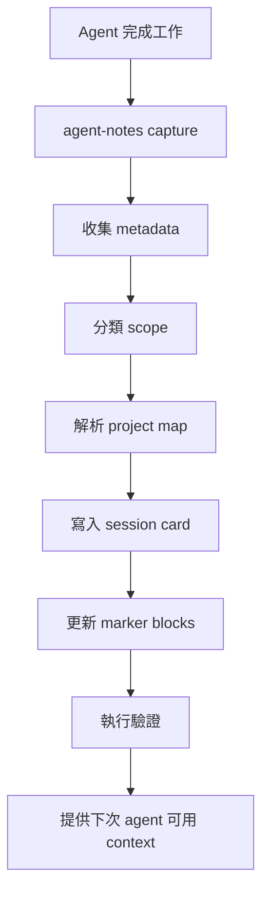

# Agent Notes PRD

## 1. 總覽

Agent Notes 是一個 local-first 筆記管理 CLI，用於 AI-assisted work。它會擷取 agent 完成的 session，轉成結構化 Markdown，安全更新專案、客戶、活動或團隊 context，並為下一次 session 準備精簡可用的 context packet。

第一批目標使用者是所有使用 AI agent 協作的人，包括一般上班族、行銷工作者、廣告投手、PM、業務、顧問、企業主管、老闆、技術管理者與開發者。他們希望用 Obsidian-compatible notes 建立穩定、可交接、可追溯的共享記憶系統。

## 2. 問題

AI agent 完成任務後，常產生有價值的工作資訊，但這些資訊通常分散在：

- 不同工具的 transcript
- 短期 chat context
- agent-specific memory store
- 臨時 Markdown 筆記
- 與實際進度逐漸脫節的 project docs、會議紀錄、活動筆記或客戶紀錄

結果是每次重新開工都要重讀 context，決策遺失，任務清單過期，投放調整脈絡不清，客戶或團隊交接不穩。

## 3. 目標

- 提供可重複執行的 CLI workflow，讓 agent 穩定寫入 session note。
- 用最少人工維護成本保持專案、客戶、活動與團隊 context 更新。
- 讓未來 agent 能快速找到相關前情。
- 同時支援專案任務與一般問答、閒聊、非專案討論。
- 不要求 Obsidian app 必須開啟。
- 避免私密資訊進入公開 repo。
- 讓同事與朋友能快速安裝到自己的 vault。

## 4. 非目標

- 取代 Obsidian。
- 取代 agent 原生 memory 系統。
- 儲存 secret 或 credential。
- 第一版就做完整 hosted SaaS。
- 綁定特定 AI vendor。
- 完美解析所有 raw transcript。

## 5. 目標使用者

| 使用者 | 需求 |
| --- | --- |
| 一般上班族 | 把 AI 協助完成的文件、會議、任務、問答整理成可回顧的工作紀錄 |
| 行銷工作人員 | 保存 campaign 發想、文案修改、素材決策、成效檢討與後續行動 |
| 廣告投手 | 追蹤投放調整、預算變更、受眾測試、素材表現與優化假設 |
| PM / 專案管理者 | 維護需求、決策、進度、阻塞、跨部門交接 |
| 業務 / 顧問 | 整理客戶脈絡、提案紀錄、待辦事項與後續追蹤 |
| 企業主管 / 老闆 | 快速掌握團隊進度、重要決策、風險、待處理事項 |
| 技術主管 / 開發者 | 追蹤實作進度、技術決策、跨 repo 工作與踩坑經驗 |
| 團隊成員 | 快速採用一套現成 vault workflow |
| AI agent | 開工前取得精簡且有效的 context |

## 6. 核心使用情境

### 6.1 擷取專案工作

當 agent 在某個 repo 完成有意義的工作後：

```bash
agent-notes capture --repo "$PWD" --tool codex
```

預期結果：

- 在對應專案底下建立 session card
- 包含 summary、changes、validation、decisions、next steps、handoff notes
- 在安全條件下更新 active tasks 與 project rollups

### 6.2 開工前取得 context

agent 開始處理任務前：

```bash
agent-notes context --repo "$PWD"
```

預期結果：

- 依 repo path 找到對應專案
- 輸出 bounded context packet
- 包含 project summary、active tasks、recent sessions、decisions、known pitfalls

### 6.3 處理非專案對話

不是所有有用筆記都屬於專案。Agent Notes 會把對話分類到以下 scope：

| Scope | 目的地 | 規則 |
| --- | --- | --- |
| ignore | 不寫入 | 低價值一次性閒聊 |
| daily | daily note | 輕量活動紀錄 |
| inbox | `01-Inbox/` | 可能有價值但尚未分類 |
| area | `04-Areas/` | 可重複使用的技術或商業知識 |
| personal | `00-Meta/Personal/` | 長期使用者偏好或工作風格 |
| project | `03-Projects/` | repo、專案、客戶、campaign 或團隊特定工作 |

### 6.4 定期彙整

```bash
agent-notes rollup --daily
agent-notes rollup --weekly
```

預期結果：

- 依專案彙整 sessions
- 列出 decisions、completed work、blocked work、next steps
- 將可長期保存的 lessons 推進 area notes 或 project context

### 6.5 系統健康檢查

```bash
agent-notes doctor
```

預期結果：

- 驗證 vault path
- 驗證 project map
- 檢查必要目錄是否可寫
- 偵測 Obsidian CLI 是否可用
- 檢查 Git 狀態
- 警告可能被追蹤的私密檔案
- 檢查 hooks 是否已設定

### 6.6 新使用者安裝後 onboarding

小白使用者透過 `npx` 或 `npm install -g` 安裝後，Agent Notes 不應自動修改 Codex、Claude Code、OpenClaw 或其他 agent 的 hook 設定。安裝後的預設體驗應是引導式設定：

```bash
npx agent-notes init
agent-notes doctor
agent-notes integrate --list
agent-notes integrate codex --dry-run
agent-notes integrate codex --apply
```

全域安裝時：

```bash
npm install -g agent-notes
agent-notes init
```

預期結果：

- `init` 第一題先選擇介面語言
- `init` 建立 local config 與 vault 目錄結構
- `doctor` 檢查本機設定、vault、project map 與可選整合
- `init` 可在 onboarding 末段讓使用者多選要設定的 agent integrations
- `integrate --list` 顯示目前支援的 agent integration
- `integrate <agent> --dry-run` 顯示會修改哪些本機設定與呼叫哪些 command
- 只有使用者明確執行 `integrate <agent> --apply` 時，才允許寫入 hook 設定

`init` 的語言選擇規則：

- 產品預設語言為英文
- 第一題提供 `English` 與 `繁體中文`
- 使用者可用 `agent-notes init --lang en` 或 `agent-notes init --lang zh-TW` 跳過互動
- 偵測到系統 locale 為 `zh_TW` 或 `zh-TW` 時，將 `繁體中文` 排在第一個選項或設為預選
- 選定語言後，後續提示、錯誤訊息與預設模板跟著該語言產生
- 語言設定寫入 local config，例如 `locale: "zh-TW"`

`init` 的 vault 選擇規則：

- 詢問使用者是否要建立新 vault、使用既有 Obsidian vault，或輸入自訂路徑
- 建立新 vault 時，預設路徑為 `~/Documents/Agent-Notes/`
- 建立前必須顯示完整路徑並取得確認
- 若目標目錄已存在且非空，不能覆蓋或清空，必須改走既有 vault 檢查流程
- 使用既有 Obsidian vault 時，不重排原本架構、不搬動既有筆記、不覆蓋同名檔案
- 若既有 vault 缺少 Agent Notes 需要的目錄，只能以 additive setup 補上必要目錄、模板與 marker-ready context files
- 補目錄或檔案前必須顯示 dry-run 摘要，列出會建立的路徑
- 若偵測到同名檔案但內容非 Agent Notes 管理，必須改用替代檔名或停止並提示使用者手動處理

## 7. 資訊架構

建議 vault 結構：

```text
00-Meta/
  Systems/
    agent-note-protocol.md
    project-map.example.json
01-Inbox/
  raw-sessions/
  shared-capture/
02-Daily/
03-Projects/
  <project>/
    03-context/
      README.md
      active-tasks.md
      decision-log.md
      pitfalls.md
    04-sessions/
04-Areas/
05-Resources/
06-Templates/
07-Archives/
```

## 8. 資料模型

### 8.1 Session Card Frontmatter

```yaml
---
type: session
title: "Short session title"
date: 2026-06-06
agent: codex
tool: Codex
project: Example
repo: /Users/example/repos/example
status: done
visibility: public-safe
source:
  kind: transcript
  path: ""
tags:
  - session
  - codex
---
```

### 8.2 Session Card Body

```markdown
# Short session title

## Summary

## Changes

## Decisions

## Validation

## Next Steps

## Handoff

## Source
```

### 8.3 Project Map

Project map 預設應放本機或私有位置。

```json
{
  "version": 1,
  "vault": "/Users/example/repos/notes",
  "projects": [
    {
      "name": "Example",
      "repo": "/Users/example/repos/example",
      "notePath": "03-Projects/Example",
      "tags": ["example"]
    }
  ]
}
```

## 9. Marker Block 策略

Agent Notes 只能更新明確標記的 generated regions：

```markdown
<!-- agent-notes:start active-tasks -->
Generated content.
<!-- agent-notes:end active-tasks -->
```

規則：

- 不重寫 marker block 外的人工內容
- 保留未知內容
- marker block 格式異常時安全失敗
- 破壞性更新前提供 backup 或 diff preview

## 10. 分類策略

Agent Notes 寫入前應先分類內容：

```yaml
type: chat | qa | idea | learning | decision | task | incident | session
scope: ignore | daily | inbox | area | personal | project
promote: false
confidence: 0.0
```

預設行為：

- 純閒聊：ignore 或 daily one-liner
- 一般問答：daily；若可重複使用則進 area
- 有用但不確定分類：inbox
- 可複用技術經驗：area
- repo、專案、客戶或 campaign-specific task：project
- 長期使用者偏好：personal 或 system note

## 11. Runtime 架構



## 12. 整合

### 12.1 Core Runtime

必要能力：

- filesystem access
- Markdown writer
- YAML frontmatter parser
- project map resolver
- Git status checker

### 12.2 Optional Obsidian CLI

可選能力：

- 搜尋筆記
- 開啟產生的 note
- 檢查 backlinks
- 驗證 properties
- 讀取 active note

核心 CLI 必須能在 Obsidian 未開啟時運作。

### 12.3 Agent Hooks

預計整合：

- Codex Stop hook
- OpenClaw cron 或 session summary workflow
- Claude Code hook
- 手動 shell command

所有 hooks 都應呼叫同一個 CLI，不應讓每個 agent 自己產生 Markdown 格式。

Agent Notes 不應在 `npm install`、`npx agent-notes` 或 `agent-notes init` 階段自動新增 hook。Hook 設定屬於高信任本機設定，會影響 agent 每次結束 session 的行為，因此必須採用明確授權流程：

| 模式 | Command | 行為 |
| --- | --- | --- |
| Manual | `agent-notes capture ...` | 使用者或 agent 手動呼叫 CLI，不修改 agent 設定 |
| Guided | `agent-notes integrate <agent> --dry-run` | 偵測環境並預覽將寫入的 hook 設定 |
| Apply | `agent-notes integrate <agent> --apply` | 使用者明確同意後才寫入本機 hook 設定 |

`init` 的 integration wizard 必須支援多選。使用者可以一次選擇 Codex、Claude Code、OpenClaw 等多個 agent，也可以選擇暫不設定。多選後仍需逐一顯示 dry-run 摘要，並在使用者確認後才套用。

`integrate` 必須遵守以下規則：

- 預設 read-only
- 修改前顯示目標檔案、變更摘要與可回復方式
- 不寫入 secret、token、channel id 或私有 project map
- 不假設所有使用者的 agent config path、shell、權限或 agent 版本一致
- 寫入前建立 backup 或提供可手動套用的 patch
- 失敗時不得影響既有 agent 設定

## 13. 隱私與 Repo 策略

公開 repo 放：

- README
- public-safe PRD
- public templates
- sample project map
- generic hook examples
- generic docs

私有 repo 或本機私有分支放：

- internal PRD
- 真實 project map
- 公司特定 channel mappings
- 敏感 runbook
- 客戶名稱或私有商業情境

重要規則：檔案一旦 commit 並 push 到公開 GitHub repo，就視為公開。Git 不支援在同一個 public repo 內做 per-file privacy。

建議配置：

```text
agent-notes/                 public repo
agent-notes-private/         private repo
~/.config/agent-notes/       local config and secrets
```

## 14. CLI Command Plan

| Command | 用途 |
| --- | --- |
| `init` | 初始化 config 與 vault directories |
| `capture` | 從目前 context 或指定檔案建立 session card |
| `context` | 為 repo 輸出 context packet |
| `rollup` | 產生每日或每週摘要 |
| `doctor` | 驗證設定 |
| `integrate` | 偵測、預覽與明確套用 agent hook integration |
| `classify` | 預覽 routing decision |
| `sync` | 可選 Git-aware note sync helper |

### 14.1 安裝後預設流程

`init` 是使用者第一次執行時的主要入口。MVP 的 `init` 應聚焦在建立 local-first runtime，而不是直接接管 agent：

1. 選擇語言，並依系統 locale 調整預選順序
2. 選擇建立新 vault、使用既有 Obsidian vault，或輸入自訂 vault path
3. 建立新 vault 時，預設使用 `~/Documents/Agent-Notes/`
4. 對既有 vault 執行 additive compatibility check
5. 顯示將建立或補齊的必要目錄與檔案
6. 使用者確認後才建立必要目錄
7. 建立 `~/.config/agent-notes/config.json`
8. 建立 public-safe sample project map
9. 顯示 manual capture 與 context command 範例
10. 詢問是否現在連接 AI agents，並提供可多選的 agent 清單
11. 對使用者選取的每個 agent 顯示 dry-run 摘要與確認提示
12. 自動執行或建議執行 `agent-notes doctor`

Hook integration 必須是 `init` 之後的獨立步驟。這能讓非技術使用者先完成安全初始化，也讓進階使用者清楚知道何時會修改本機 agent 設定。

## 15. MVP 範圍

Version 0.1 應包含：

- Node.js + TypeScript CLI
- `init`
- `doctor`
- `context --repo`
- `capture --repo --tool --summary-file`
- `integrate --list`
- `integrate <agent> --dry-run`
- direct Markdown writes
- project map support
- frontmatter schema
- marker block updater
- dry-run mode
- 安裝後下一步提示
- routing 與 marker replacement 的基礎測試

## 16. Roadmap

### Phase 1：Local CLI

- 建立 Node.js + TypeScript CLI
- 定義 schema
- 寫入並驗證 Markdown
- 支援 project context retrieval
- 支援安裝後 onboarding 與 integration dry-run

### Phase 2：Agent Hooks

- Codex Stop hook example
- OpenClaw workflow example
- Claude Code hook example
- dry-run safeguards
- `integrate <agent> --apply`

### Phase 3：Rollups

- daily summaries
- weekly summaries
- decision extraction
- task extraction
- area knowledge promotion

### Phase 4：Sharing Kit

- installer script
- template vault files
- sample config
- `agent-notes doctor --fix`
- public documentation site 或 GitHub Pages

## 17. 成功指標

- 新 agent 能在 30 秒內找到相關 project context。
- Session notes 都以有效 frontmatter 穩定寫入。
- Project active tasks 與 decisions 不需人工複製也能保持更新。
- 非專案閒聊不污染 project notes。
- 私密資料不被 tracked 到公開 repo。
- 團隊成員能在 10 分鐘內安裝並跑起 MVP。

## 18. 風險

| 風險 | 緩解方式 |
| --- | --- |
| 過度擷取低價值閒聊 | classification 預設 ignore/daily |
| 私密資料外洩 | ignored private paths、doctor warnings、public-safe examples |
| agent 產生的 Markdown 格式漂移 | 由單一 CLI 負責格式 |
| Obsidian dependency 不穩 | filesystem-first design |
| 人工筆記被覆蓋 | marker blocks 與 dry-run mode |
| 自動 hook 修改造成使用者不信任 | 不在 install/init 自動修改 hook，採 `integrate --dry-run` 與 `--apply` |

## 19. Open Questions

- Session card 應存 raw transcript pointer，還是複製節錄？
- Rollup 第一版要用 local LLM、hosted LLM，還是 rule-based extraction？
- `init` 是否要內建 private companion repo 支援？
- Project map 是否要支援多 vault？

## 20. 初始建議

第一版先做小型 filesystem-first CLI，之後再加 optional Obsidian CLI integration 與 agent hooks。公開 repo 保持不含私密 mapping 與內部策略；真正內部 PRD 或公司特定設定應放在 private companion repo 或本機設定中。
