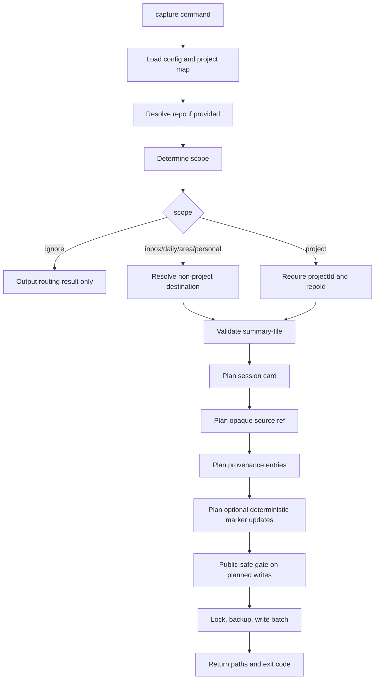

# Capture Pipeline 架構

Status: draft
Last Updated: 2026-06-06
Source: 從 `docs/PRD.md` 拆分整理

本檔定義 capture command 從 summary file 到 session card 與 context marker 更新的流程。

---

## Capture Pipeline

規則：

- `--scope ignore` 不讀寫 session card
- `--scope project` 必須成功解析 project map
- 未提供 `--scope` 時，repo resolution 成功才走 project，失敗則走 inbox
- `summary-file` 驗證必須早於任何寫入
- public-safe gate 必須掃描最終規劃寫入的 frontmatter、body 與 marker diff，而不是只掃描原始 summary file
- source path 只寫入 `.agent-notes/source-index.json`，session card 只存 opaque ref
- Phase 1 不複製 raw transcript；`--source-file` 只建立 local pointer，`--include-raw` 回傳 `FEATURE_UNSUPPORTED`
- marker updates 只能使用 summary-file 的明確 sections，不做 LLM 推論
- decisions、tasks、context updates 與對應 provenance entry 必須在同一 write batch 內完成
- 寫入 session card、source index、provenance log、marker block 前都必須遵守 lock / backup / atomic write 規則
