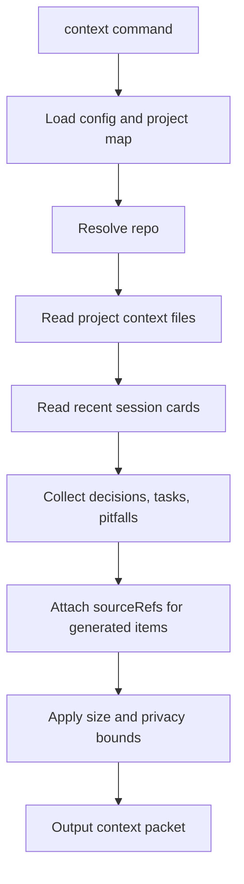

# Context Pipeline 架構

Status: draft
Last Updated: 2026-06-06
Source: 從 `docs/PRD.md` 拆分整理

本檔定義 context command 如何組合 project context、近期 session 與交接資訊。

---

## Context Pipeline



規則：

- `context` 不應呼叫 LLM
- `context` 不應讀取 `private/raw-sessions/`
- 輸出必須有 size bound，避免塞滿下一個 agent 的 context
- context packet 中的 generated decisions/tasks 應保留 item id 與 sourceRefs
- 找不到 project 時回傳 `PROJECT_NOT_FOUND`；v0.1 personal vault 提示 `agent-notes project add --repo "$PWD"`；Phase 4 Team Vault 提示 `agent-notes project attach --repo "$PWD" --project-id <id>`

## Phase 1 Packet Contract

Phase 1 `context` 輸出純文字 Markdown packet，不寫檔、不開 editor、不呼叫 Obsidian CLI。預設上限為 12000 characters；`--max-chars` 只能降低或提高本次輸出上限，但不得讓 command 讀取 private paths。

固定 section 順序：

1. `# Agent Notes Context`
2. `## Project`
3. `## Project Summary`
4. `## Active Tasks`
5. `## Recent Decisions`
6. `## Pitfalls`
7. `## Recent Sessions`
8. `## Trace Hints`

輸出規則：

- `Project` 顯示 project id、project name 與 vault-relative note path，不顯示本機 repo 絕對路徑。
- `Project Summary` 讀取 `project-summary` marker block 的 `CTX-*` generated item；若沒有 summary，輸出 `- none`。
- `Active Tasks`、`Recent Decisions`、`Pitfalls` 只輸出 marker block 內的 generated items，保留 item id、status、session 與 `sourceRefs`。
- `Recent Sessions` 預設取最近 5 筆 valid session card，依 `capturedAt` 新到舊排序；缺少或無法解析 `capturedAt` 的 session card 不列入，並在 output 加 warning。
- `Trace Hints` 列出本 packet 內出現過的 `sourceRefs` 與可用的 `agent-notes trace <id>` 範例。
- 空 section 保留標題並輸出 `- none`，讓 agent 不需要猜 section 是否遺漏。
- 超過 size bound 時，先截短 `Recent Sessions`，再截短 `Pitfalls`，最後截短 `Active Tasks`；被截短的 section 需加上 `- omitted: <count> items due to max-chars`。
- 若 project context file 缺少某個 marker block，`context` 不自動建立；輸出該 section 為 `- unavailable: marker missing`，exit code 仍為 `OK`。格式錯誤才交由 `doctor` 或 `capture` 回報 `MARKER_INVALID`。

最小範例：

```markdown
# Agent Notes Context

## Project
- projectId: agent-notes
- name: Agent Notes
- notePath: 03-Projects/Agent Notes

## Project Summary
- CTX-0001 | Local-first CLI that turns agent work into searchable Markdown notes
  - session: SES-20260606-001
  - sourceRefs: src_20260606_codex_001

## Active Tasks
- TASK-0001 | 實作 marker block updater
  - status: planned
  - session: SES-20260606-001
  - sourceRefs: src_20260606_codex_001

## Recent Decisions
- DEC-0001 | 採用 Node.js + TypeScript 作為 MVP CLI runtime
  - status: accepted
  - session: SES-20260606-001
  - sourceRefs: src_20260606_codex_001

## Pitfalls
- none

## Recent Sessions
- SES-20260606-001 | Phase 1 planning
  - notePath: 01-Inbox/2026-06-06-phase-1-planning.md
  - sourceRefs: src_20260606_codex_001

## Trace Hints
- agent-notes trace DEC-0001
- agent-notes trace src_20260606_codex_001
```
