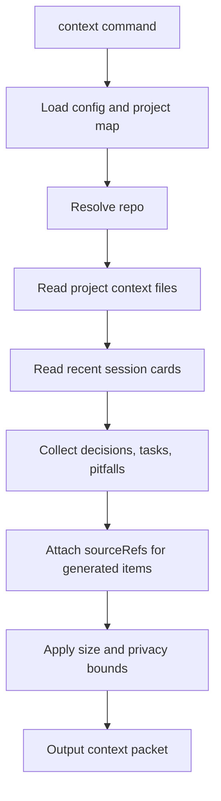

# Context Pipeline 架構

Status: draft
Last Updated: 2026-06-06
Source: 從 `docs/PRD.md` 拆分整理

本檔定義 context command 如何組合 project context、近期 session 與交接資訊。

---

## Context Pipeline

規則：

- `context` 不應呼叫 LLM
- `context` 不應讀取 `private/raw-sessions/`
- 輸出必須有 size bound，避免塞滿下一個 agent 的 context
- context packet 中的 generated decisions/tasks 應保留 item id 與 sourceRefs
- 找不到 project 時回傳 `PROJECT_NOT_FOUND`；v0.1 personal vault 提示 `agent-notes project add --repo "$PWD"`；Phase 4 Team Vault 提示 `agent-notes project attach --repo "$PWD" --project-id <id>`
