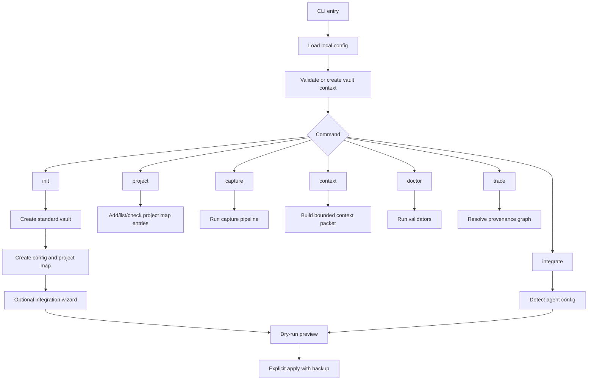

# Runtime 架構

Status: draft
Last Updated: 2026-06-06
Source: 從 `docs/PRD.md` 拆分整理

本檔定義 Agent Notes CLI runtime 的核心元件與 command runtime。

---

## Runtime 架構

Runtime 必須是 filesystem-first，所有 command 共用同一組核心元件，不讓不同 agent 或不同 command 自己產生 Markdown 格式。

## 核心元件

| 元件 | 責任 |
| --- | --- |
| Config Loader | 讀取 `~/.config/agent-notes/config.json`，套用 locale、vault path、privacy defaults |
| Vault Manager | 建立與驗證標準 Agent Notes vault、vault `.gitignore`、必要目錄與模板 |
| Project Resolver | 讀取 local/private project map，依 repo path 解析 `projectId`、`repoId`、`notePath` |
| Router | 依 `--scope`、repo resolution 與 deterministic rules 決定目的地 |
| Capture Parser | 驗證 `--summary-file` headings 與必要內容，處理 `--source-file` pointer |
| Frontmatter Writer | 產生 session card frontmatter，不寫入絕對路徑或 private project map path |
| Source Index | 維護 `.agent-notes/source-index.json`，將 opaque source ref 對應到本機 source path |
| Provenance Store | 維護 `.agent-notes/provenance.jsonl`，記錄 source、session、derived item 的關係 |
| Marker Updater | 只更新 marker block 內 generated content，支援 dry-run、backup、lock、atomic write |
| Write Safety | 提供 write plan、lock、backup、atomic write 與 rollback 共用流程 |
| Context Builder | 讀取 project context、recent sessions、decisions、pitfalls，輸出 bounded context packet |
| Trace Resolver | 依 item id 或 source ref 追溯 session、source、note path 與 derivedFrom |
| Doctor | 驗證 config、vault、project map、Git 狀態、private path 與 integration 狀態 |
| Integration Engine | 偵測、dry-run、backup、apply agent hook 設定 |

## Command Runtime

規則：

- `init` 是唯一可建立新 vault 的 command
- `project` 只修改 local/private project map 與對應 vault 目錄
- `capture` 負責建立 session card 與 deterministic marker updates
- `context` 不寫入 vault，只輸出 bounded context packet
- `doctor` 預設 read-only；未來 `doctor --fix` 需另行明確授權
- `integrate` engine 可由 `init` wizard 呼叫，也可由使用者獨立執行
- `trace` 預設 read-only，只讀取 session cards、source index 與 provenance log
- 寫檔 command 共用 [`write-safety.md`](../specs/write-safety.md) 的 write batch 契約
